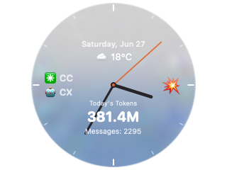

<div align="center">

[简体中文](README.md) · **English**

# 🕰️ TokenClock

**A floating macOS desktop clock that shows the real-time token usage of all your AI coding tools at a glance.**

[](https://www.apple.com/macos/)
[](https://developer.apple.com/macos/)
[](https://www.swift.org/)
[](https://developer.apple.com/xcode/swiftui/)
[](https://www.swift.org/package-manager/)
[](#-privacy)
[](LICENSE)

</div>

<div align="center">



</div>

---

TokenClock is an **always-on-top floating clock** for your desktop (draggable · remembers its position). The dial overlays live data: **today's total token consumption, message counts, the AI tools currently active, a rate indicator, and the weather**. Click the clock to expand a dropdown panel that breaks usage down by **each tool → each session / agent**.

It's built with the macOS 26 **Liquid Glass** material for a crystal clock disc, ships with 6 carefully designed built-in faces plus a fully custom theme editor, and reads **everything locally** — nothing is ever uploaded.

---

## ✨ Features

### 🤖 Unified multi-AI-tool detection
- **One clock aggregates real-time token / message usage from 14 AI coding tools** — no more juggling terminals.
- The dial overlays **today's totals, active-tool labels, and a rate emoji** (🔥 burst / 🌊 calm thresholds).
- Click to expand the **dropdown panel**: usage broken down by tool → session / agent at a glance.

### 🧊 Liquid Glass
- On macOS 26 the disc renders with the native **Liquid Glass** material — it adapts to your wallpaper and carries a subtle theme tint.
- **Adaptive high-contrast ink**: lighter-tinted themes automatically switch to near-black ticks / numerals for legibility.
- Ships in **two variants** — `main` (macOS 26) and `normal` (macOS 15) — and the `tokenclock` CLI picks the right one for your OS automatically.

### 🎨 Multiple faces & thoughtful design
- 6 built-in faces (Classic / Midnight / Luxe / Gu Feng / Railgun / Sky), each with its own personality.
- 4 hand styles (round / tapered / lance / sword); numerals in Arabic or Chinese.
- **Fully custom themes**: dial color, glass tint, all three hands, ticks, numerals, borders, and fonts are all adjustable.

### ⚙️ More
- Live clock (1s), usage refresh (30s), weather (5min).
- Weather + 12-hour forecast (auto-located by IP or pick a city); 8 time zones.
- Internationalization: **Simplified Chinese / Traditional Chinese / English**.
- Always-on-top · draggable · position remembered across relaunch; launch-at-login via `SMAppService`.
- Local API server (`:9988`) for integration / scripting.
- Privacy-first: **all data read locally, zero upload**.

---

## 📸 Screenshots

<table>
  <tr>
    <td width="50%" align="center"><b>Floating glass clock</b><br>tokens / messages / rate / weather on the dial</td>
    <td width="50%" align="center"><b>Expanded detail panel</b><br>usage broken down by tool → session / agent</td>
  </tr>
  <tr>
    <td width="50%" align="center"></td>
    <td width="50%" align="center"></td>
  </tr>
  <tr>
    <td colspan="2" align="center"><b>Theme picker</b> · 6 built-in faces + custom</td>
  </tr>
  <tr>
    <td colspan="2" align="center"></td>
  </tr>
</table>

---

## 🤖 Supported AI tools

TokenClock reads the **JSONL / SQLite usage files** that each tool writes locally (path priority: custom path > env var > default path; auto-detected on first launch). Defaults and env vars below.

| Tool | Default data source | Env var |
|------|---------------------|--------|
| **OpenClaw** | `~/.openclaw/` | `OPENCLAW_HOME` |
| **Claude Code** | `~/.claude/` | `CLAUDE_CONFIG_DIR` |
| **Gemini CLI** | `~/.gemini/` | `GEMINI_HOME` |
| **Codex** | `~/.codex/` | `CODEX_HOME` |
| **Hermes** | `~/.hermes/` | `HERMES_HOME` |
| **OpenCode** | `~/.local/share/opencode/` | `OPENCODE_HOME` |
| **Qwen Code** | `~/.qwen/` | `QWEN_HOME` |
| **GitHub Copilot CLI** | `~/.copilot/` | `COPILOT_HOME` |
| **Grok CLI** | `~/.grok/` | `GROK_HOME` |
| **Aider** | `~/.aider/analytics.jsonl` | `AIDER_HOME` |
| **Antigravity** | `~/.gemini/antigravity-cli/` | `ANTIGRAVITY_HOME` |
| **Cline** (VSCode extension) | `~/Library/Application Support/Code/User/globalStorage/saoudrizwan.claude-dev/` | `CLINE_HOME` |
| **Continue** (VSCode extension) | `~/.continue/` | `CONTINUE_HOME` |
| **Cursor Agent** | `~/.cursor/` | `CURSOR_AGENT_HOME` |

> Token-counting formulas differ slightly per service (e.g. Codex's `input_tokens` already includes cached tokens, so it uses `total_tokens + reasoning_output_tokens`; other services sum input/output/cache fields that are mutually exclusive). See `docs/TOOL_SCHEMA_ANALYSIS.md`.

---

## 🚀 Quick start

### One-line install (easiest)

Auto-detects the macOS version → builds the matching variant → installs to `~/.tokenclock` → puts `tokenclock` on your PATH → launches and scans each AI tool's local paths — no manual steps.

```bash
# if you've cloned this repo, run it directly:
./cli/install.sh

# or (once publicly hosted, replace <your-host>) one-line install:
curl -fsSL https://<your-host>/raw/main/cli/install.sh | bash
```

Options: `--debug` (faster build) / `--normal` / `--glass` / `--no-start` (don't auto-launch).

> Or build manually from source below.

### Prerequisites
- **macOS 15+** (normal build); **macOS 26+** (Liquid Glass build)
- Swift 6 toolchain (Xcode 16+ / Command Line Tools)

### Build & run from source

```bash
git clone <your-repo-url> TokenClock
cd TokenClock

# debug build and run directly
swift run

# or build first, then run
swift build            # debug
swift build -c release # release
.build/debug/TokenClock      # or .build/release/TokenClock
```

> The `main` branch's `Package.swift` declares `.macOS(.v26)`, so `swift run` produces the Liquid Glass build; the classic (opaque) macOS 15-compatible build lives on the `normal` branch.

### Use the `tokenclock` CLI

Install the lightweight shell script onto your PATH:

```bash
sudo install -m755 cli/tokenclock /usr/local/bin/tokenclock
```

| Command | Description |
|---------|-------------|
| `tokenclock start [--glass\|--normal] [--force]` | Start the clock; auto-picks by OS (26+ → glass, 15+ → normal); `--force` opens another instance |
| `tokenclock stop` | Stop all running TokenClock instances |
| `tokenclock restart [--glass\|--normal]` | Restart |
| `tokenclock doctor` | Diagnose: OS version, installed variant paths, running processes, env vars |
| `tokenclock update` | Update (placeholder until the update server is deployed) |
| `tokenclock help` | Show help |

**Variant discovery order**: `$TOKENCLOCK_GLASS` / `$TOKENCLOCK_NORMAL` env vars → `~/.tokenclock/` → `/Applications/` → repo `.build/debug/`.

---

## 🎨 Themes

6 built-in faces, plus full custom:

| Theme | Name | Personality |
|-------|------|-------------|
| `classic`  | Classic    | Clear glass disc · charcoal hands + amber second hand · 3/6/9/12 only |
| `midnight` | Midnight   | Cyan glass · cyan tapered hands |
| `luxe`     | Luxe       | Gold glass · gold lance hands |
| `gufeng`   | Gu Feng    | Warm-brown glass · ink sword hands · **Chinese numerals** |
| `railgun`  | Railgun    | Pink-orange glass · electric-blue second hand · monospaced |
| `sky`      | Sky        | Blue glass · sun & clouds · gold hands |
| `custom`   | Custom     | Glass tint / hands / ticks / numerals / fonts… fully customizable |

**Right-click** the clock → theme picker, or open the theme editor in the settings window to switch or customize.

---

## 🧊 Liquid Glass

TokenClock ships in two builds:

| Branch | Target | Rendering |
|--------|--------|-----------|
| `main`   | **macOS 26+** | Native Liquid Glass material; the disc adapts to the wallpaper and carries a subtle tint |
| `normal` | macOS 15+     | Classic opaque themed dial, for backward compatibility |

- The glass disc uses an **ambient tint (glass tint)** instead of the old opaque dial fill: a clean glass base plus a theme hint color, preserving each face's character without hiding your wallpaper.
- Lighter-tinted themes (Luxe / Railgun / Sky) automatically use **high-contrast near-black ink** for text, ticks, and numerals; darker/mid tints (Classic / Midnight / Gu Feng) use pure white.
- The `tokenclock` CLI selects the matching variant from the `sw_vers` major version — no manual guessing.

---

## 🔌 Local API server

TokenClock starts a local `NWListener` HTTP server:

```
GET http://127.0.0.1:9988/api/usage
```

It returns the aggregated JSON usage of all tools, handy for external scripts / dashboards. It listens on loopback only and is **never exposed externally**.

---

## 🔒 Privacy

- All usage data is **read locally** from the log files each AI tool writes itself — TokenClock **uploads no token / session data**.
- The local API server listens only on `127.0.0.1` and is opt-in.
- Weather uses approximate IP geolocation or a city you pick, solely to show current conditions and a forecast.

---

## 🛣 Roadmap

- [ ] `tokenclock update` — deploy an update server for one-command fetch / install
- [ ] Support more AI coding tools (keep extending the detector)
- [ ] Signed / notarized release builds (`.app`)
- [ ] Richer history stats and charts

---

## 📦 Tech stack

| | |
|---|---|
| **Language** | Swift 6 (`-parse-as-library`) |
| **UI** | SwiftUI + AppKit (lock-free dual-`NSPanel` architecture) |
| **Build** | Swift Package Manager (no `.xcodeproj`) |
| **Platforms** | macOS 26 SDK (`main` branch) / macOS 15 SDK (`normal` branch) |
| **i18n** | Custom `L10n` engine (zh-Hans / zh-Hant / en, no `.xcstrings`) |
| **Size** | ~10,700 lines of Swift |

---

## 📄 License

TokenClock is open-sourced under the **[MIT License](LICENSE)** — © 2026 nxc8335. Use it, modify it, ship it freely; just keep the copyright notice.

---

## 🙏 Acknowledgments

TokenClock exists thanks to the many excellent AI coding tools and their communities. Thanks to these tools for writing token usage to local logs, making unified visualization possible. The dial designs draw inspiration from traditional mechanical watches and pop culture (the Gu Feng / Railgun themes).

---

<div align="center">

**⭐ If TokenClock helps you, a Star is appreciated.**

</div>
