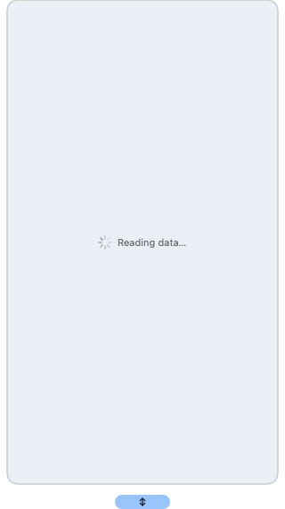

<div align="center">

[简体中文](README.zh-CN.md) · **English**

# 🕰️ TokenClock

**A beautiful desktop clock for seeing your AI coding usage at a glance.**

[](#macos-and-linux)
[](#macos-and-linux)
[](#macos-and-linux)
[](#windows)
[](#macos-and-linux)

[](https://www.swift.org/)
[](LICENSE)
[](https://github.com/Neo-Isshin/TokenClock/releases)

</div>

<div align="center">

<table>
  <tr>
    <td align="center"><br><sub><b>Liquid Glass</b> · macOS 26+</sub></td>
    <td align="center"><br><sub><b>Normal</b> · macOS, Windows, Linux</sub></td>
  </tr>
</table>

</div>

TokenClock is a small, always-on-top clock for your desktop. It combines the time with today's token usage, message count, active AI tools, weather, and usage pace—without making you open several dashboards.

Click the clock for session and model details. Right-click it to change the face, size, city, timezone, language, transparency, and other preferences.

## What you get

- **14+ AI coding tools in one place.** TokenClock finds their local usage data automatically and lets you correct a path in Settings when needed.
- **A clearer usage total.** Reused prompt-cache reads stay out of the main number, while new input, cache creation, output, and reasoning still count.
- **8 carefully designed clock faces.** Glass, Classic, Glacier, Midnight, Luxe, Antique, Railgun, and Sky, plus saved custom faces.
- **Useful details without leaving the desktop.** Group usage by session or model, expand individual rows, and sort by percentage.
- **Cost estimation.** Today's token usage converted to USD at API list prices (catalog from LiteLLM, auto-refreshed weekly); custom proxy models can be priced manually in Settings.
- **Subscription quotas in one panel.** View Codex, Claude Code, Antigravity, and Cursor limits and reset times when those local accounts are available. Checks run only when you open the panel.
- **Weather without a location permission popup.** Automatic weather uses an approximate city from your public IP, or you can choose a city yourself.
- **A native experience on each platform.** macOS uses SwiftUI/AppKit, Windows uses Win32, and Linux uses GTK3. The workflow is shared while controls keep their native appearance.

## Platform support

| Platform | Edition | Notes |
|---|---|---|
| macOS 26+ | Liquid Glass + Normal | Universal Apple Silicon/Intel build; supports macOS 27 Beta 5 |
| macOS 12–25 | Normal | Classic opaque desktop widget |
| Windows 11 x86_64 | Normal | Per-user install; no administrator rights required |
| Linux x86_64 | Normal | Prebuilt GTK3 AppImage; glibc 2.35+ |

## Install

### macOS and Linux

Paste this into Terminal:

```bash
curl -fsSL https://raw.githubusercontent.com/Neo-Isshin/TokenClock/main/cli/install.sh | bash
```

The installer chooses the right edition, verifies downloaded builds, starts TokenClock, and installs the small `tokenclock` helper command.

Useful commands after installation:

```bash
tokenclock doctor
tokenclock restart
tokenclock update
tokenclock uninstall
```

On Linux, install `libfuse2` if your desktop cannot open the AppImage (`libfuse2t64` on Ubuntu 24.04+).

### Windows

Paste this into PowerShell:

```powershell
& ([scriptblock]::Create((irm https://raw.githubusercontent.com/Neo-Isshin/TokenClock/windows-port/cli/install.ps1)))
```

TokenClock installs for the current user under `%LOCALAPPDATA%\Programs\TokenClock`. It verifies the release checksum and does not enable autostart or create shortcuts unless you ask it to.

Windows may show a reputation warning for an unsigned first release. Check that the publisher source is this repository before continuing.

<details>
<summary>Optional Windows installer choices</summary>

```powershell
# Install without starting, and add a Start Menu shortcut
& ([scriptblock]::Create((irm https://raw.githubusercontent.com/Neo-Isshin/TokenClock/windows-port/cli/install.ps1))) -NoStart -StartMenuShortcut

# Check the current installation
& ([scriptblock]::Create((irm https://raw.githubusercontent.com/Neo-Isshin/TokenClock/windows-port/cli/install.ps1))) -Action Check

# Uninstall while keeping your settings
& ([scriptblock]::Create((irm https://raw.githubusercontent.com/Neo-Isshin/TokenClock/windows-port/cli/install.ps1))) -Action Uninstall
```

</details>

## Everyday use

- **Left-click the clock:** show or hide usage details.
- **Subscription Quota:** show Codex, Claude Code, Antigravity, and Cursor limits and reset times.
- **Cost column:** estimated USD cost of today's usage at API list prices (customize prices in Settings).
- **By Session / By Model:** change how details are grouped.
- **By Percent:** compare which tools consumed the most.
- **Click a detail row:** expand its sessions or models.
- **Right-click the clock:** open faces, sizes, display preferences, refresh, Settings, About, and Quit.
- **Drag the clock:** place it anywhere on your desktop; its position is remembered.

Settings includes automatic detection, tool switches, custom data paths, rate thresholds, the local API, and custom clock faces. Available rows may differ slightly by platform.

## Supported tools

| | | |
|---|---|---|
| OpenClaw | Claude Code | Gemini CLI |
| Codex | Hermes | OpenCode |
| Qwen Code | GitHub Copilot CLI | Grok CLI |
| Aider | Antigravity | Cline |
| Continue | Cursor Agent | |

Most tools need no setup. If a tool stores data somewhere unusual, open **Settings → Data Source Paths** and choose its folder or file.

Windows also offers optional Kiro session-contract detection and experimental CodeBuddy current-session statistics.

## Screenshots

<div align="center">

<table>
  <tr>
    <td align="center"><br><sub>Usage details</sub></td>
    <td align="center"><br><sub>Clock face picker</sub></td>
    <td align="center"><br><sub>Normal edition</sub></td>
  </tr>
</table>

</div>

## Privacy

- Token and session totals are read from files already stored by your AI tools. TokenClock does not upload those logs or totals.
- The optional local API listens only on `127.0.0.1`.
- Automatic weather contacts the configured weather/IP services to estimate a city. It does not request macOS Location Services permission.
- Subscription Quota runs only when you open its panel. It uses each installed tool's local signed-in service or saved credentials when available; TokenClock does not ask you to paste account secrets.
- Cursor cloud usage is optional. When enabled, it contacts Cursor's service using the credentials already stored by Cursor; leave it off if you only want local data.

## Local API (optional)

TokenClock can expose read-only JSON for personal scripts and dashboards:

```text
http://127.0.0.1:9988/api/usage
http://127.0.0.1:9988/api/history?days=30
```

The server is loopback-only, so other computers cannot connect to it directly.

## Troubleshooting

- **A tool shows zero:** use Re-detect in Settings, then check its Data Source Path. The tool must have created at least one local session first.
- **A subscription quota is unavailable:** make sure the corresponding tool is installed and signed in, then retry from the quota panel. Some providers may not expose quota data on every plan or platform.
- **Weather is unavailable:** choose a city manually or check whether `wttr.in` is reachable from your network.
- **Linux AppImage does not start:** run `tokenclock doctor`, then reinstall. On systems without FUSE 2, the launcher automatically uses extraction mode and does not require `sudo`.
- **Something is using too much CPU:** update and restart TokenClock. Recent builds avoid repeatedly scanning old Codex and Gemini histories.
- **Still stuck:** run `tokenclock doctor` on macOS/Linux, or open a [GitHub issue](https://github.com/Neo-Isshin/TokenClock/issues) with your platform and TokenClock version.

## Build from source

Most people should use the installers above. For contributors:

```bash
git clone https://github.com/Neo-Isshin/TokenClock.git
cd TokenClock
swift build -c release
```

The Normal edition shares its features across macOS, Windows, and Linux while keeping native controls and platform-specific data paths. Liquid Glass remains a separate macOS presentation built on the same usage core.

## License

TokenClock is open-sourced under the **[MIT License](LICENSE)** — © 2026 Neo-Isshin.

## Acknowledgments

- [Swift](https://www.swift.org/) and SwiftUI/AppKit
- GTK and Cairo for the Linux normal edition
- The AI coding tools whose local data formats make this overview possible
- Everyone who reports issues, tests new platforms, and improves TokenClock
