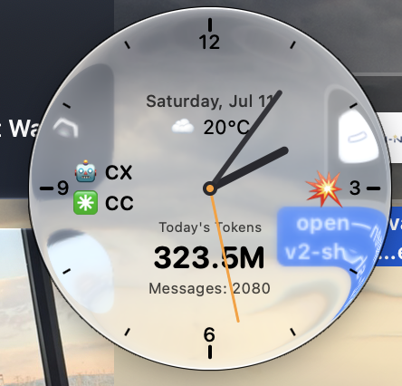
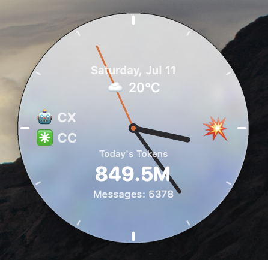
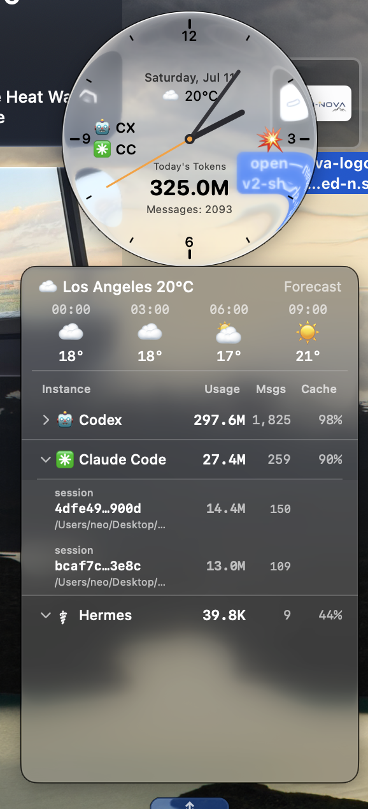
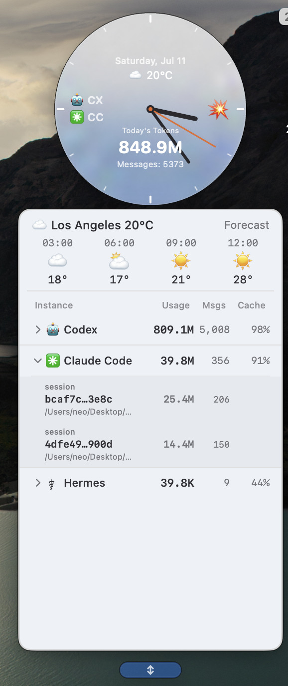
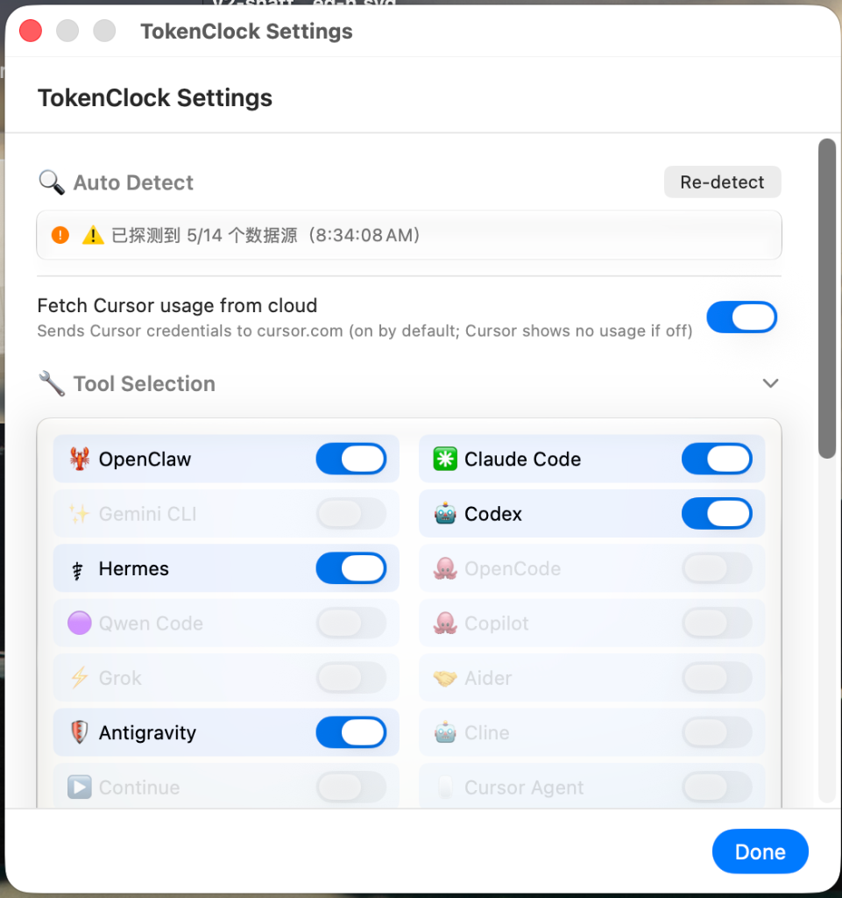
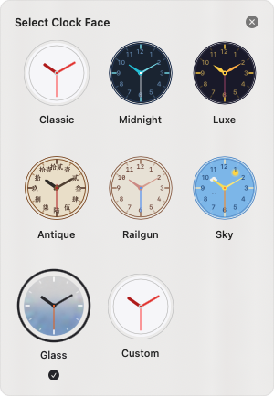
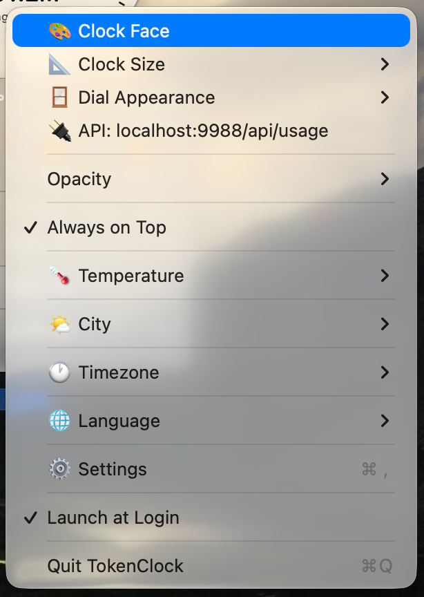
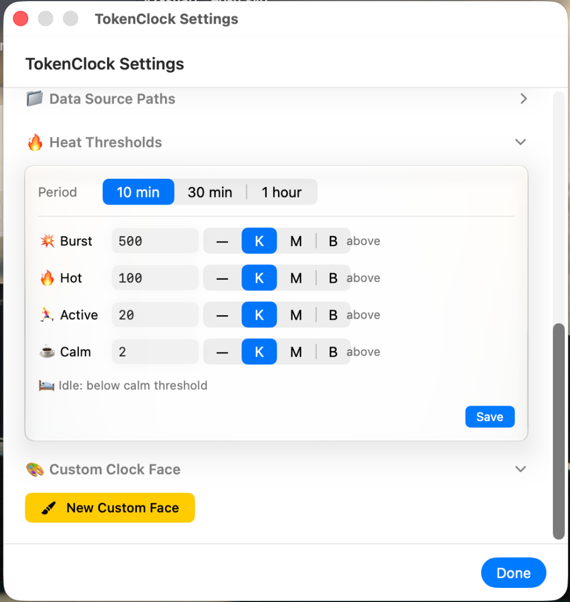

<div align="center">

[简体中文](README.zh-CN.md) · **English**

# 🕰️ TokenClock

**A native Liquid Glass token clock · every agent's consumption on a single dial**

[](https://www.apple.com/macos/)
[](https://developer.apple.com/macos/)
[](#linux-normal-build)

[](https://www.swift.org/)
[](https://developer.apple.com/xcode/swiftui/)
[](https://www.swift.org/package-manager/)
[](#-privacy)
[](LICENSE)
[](https://github.com/Neo-Isshin/TokenClock/releases)

</div>

<div align="center">

<table>
  <tr>
    <td width="50%" align="center"><br><sub><b>Liquid Glass build</b> · macOS 26+</sub></td>
    <td width="30%" align="center"><br><sub><b>Normal build</b> · macOS 12+</sub></td>
  </tr>
</table>

</div>

---

TokenClock is an **always-on-top floating clock** for your desktop (draggable · remembers its position). The dial overlays live data: **today's total token consumption, message counts, the AI tools currently active, a rate indicator, and the weather**. Click the clock to expand a dropdown panel that breaks usage down by **each tool → each session / agent**.

It's built with the macOS 26 **Liquid Glass** material for a crystal clock disc, ships with 7 carefully designed built-in faces plus a fully custom theme editor, and reads **everything locally** — nothing is ever uploaded.

> [!NOTE]
> Liquid Glass build has supported macOS 27 beta 3, but may break with beta version updates.

---

## 📑 Contents

- [🌟 Core advantages](#-core-advantages)
- [✨ Features](#-features)
- [📸 Screenshots](#-screenshots)
- [🤖 Supported AI tools](#-supported-ai-tools)
- [🚀 Quick start](#-quick-start) — [One-line install](#one-line-install-easiest) · [`tokenclock` CLI](#use-the-tokenclock-cli)
- [🎨 Themes](#-themes)
- [🧊 Liquid Glass](#-liquid-glass)
- [🔌 Local API server](#-local-api-server)
- [🔒 Privacy](#-privacy)
- [🛣 Roadmap](#-roadmap)
- [📦 Tech stack](#-tech-stack)
- [📄 License](#-license)
- [🙏 Acknowledgments](#-acknowledgments)

---

## 🌟 Core advantages

<table>
  <tr>
    <td width="50%" valign="top"><b>🤖 All your tools, one dial</b><br><sub>Token / message usage from <b>14 AI coding tools</b> flows into a single clock face — no more hopping between terminals and web dashboards.</sub></td>
    <td width="50%" valign="top"><b>🔍 Drill down per session / agent</b><br><sub>From a per-tool overview all the way down to every session / agent — see exactly where the tokens went and which conversation burned them.</sub></td>
  </tr>
  <tr>
    <td valign="top"><b>🌤️ Always on the desktop, zero friction</b><br><sub>A floating, always-on-top, translucent Liquid Glass disc; a glance gives you the live consumption and rate (🔥 burst / 🌊 calm).</sub></td>
    <td valign="top"><b>📈 Multi-dimensional live insight</b><br><sub>Today's totals, cache rate, future-trend forecast, and active tools in one picture.</sub></td>
  </tr>
  <tr>
    <td valign="top"><b>🎨 Rich customization</b><br><sub>6 built-in faces + a fully custom theme: frosted backing opacity, glass tint, text color, hands, ticks, numerals, fonts, dial size, window opacity.</sub></td>
    <td valign="top"><b>📜 Usage history you can revisit</b><br><sub>Each day's usage is auto-settled into a local SQLite store (30 days) and exposed via the local API — feed your own charts.</sub></td>
  </tr>
  <tr>
    <td valign="top"><b>⚡ Tiny footprint</b><br><sub>Native Swift + efficient polling (clock 1s / usage 30s / weather 5min) + streaming JSONL; sits in the background almost unnoticed.</sub></td>
    <td valign="top"><b>🔒 Purely local, zero upload</b><br><sub>Reads only local logs each tool writes; nothing leaves your machine, and the API listens on <code>127.0.0.1</code> only.</sub></td>
  </tr>
  <tr>
    <td colspan="2" valign="top"><b>🔌 Zero config, ready out of the box</b><br><sub>Auto-detects 14 AI coding tools' log paths on first launch. New tools without history are auto-discovered by background workers on their first session, requiring no manual setup.</sub></td>
  </tr>
</table>

---

## ✨ Features

### 🤖 Unified multi-AI-tool detection
- Auto-detects and reads the local token / message usage logs written by **14 AI coding tools** and aggregates them.
- The dial overlays **today's totals, active-tool labels, and a rate emoji** (🔥 burst / 🌊 calm thresholds).
- Click to expand the **dropdown panel** for the breakdown (tool → session / agent; see [Core advantages](#-core-advantages)).

### 🧊 Liquid Glass
- On macOS 26 the disc renders with the native **Liquid Glass** material — it adapts to your wallpaper and carries a subtle theme tint.
- **Adaptive high-contrast ink**: lighter-tinted themes automatically switch to near-black ticks / numerals for legibility.
- Ships in **two variants** — `main` (macOS 26) and `normal` (macOS 12) — and the `tokenclock` CLI picks the right one for your OS automatically.

### 📦 One-line install & CLI
- The normal build runs on **macOS 12+ and Linux**, while the Liquid Glass build remains macOS 26+ only. The lightweight `tokenclock` CLI handles start / stop / diagnose on both platforms.

### 🎨 Multiple faces & thoughtful design
- 6 built-in faces (Classic / Midnight / Luxe / Gu Feng / Railgun / Sky), each with its own personality.
- 4 hand styles (round / tapered / lance / sword); numerals in Arabic or Chinese.
- **Fully custom themes**: dial color, glass tint, all three hands, ticks, numerals, borders, and fonts are all adjustable.

### ⚙️ More
- Live clock (1s), usage refresh (30s), weather (5min).
- Weather + 12-hour forecast (auto-located by IP or pick a city); 8 time zones.
- Internationalization: **Simplified Chinese / Traditional Chinese / English**.
- Always-on-top · draggable · position remembered across relaunch; launch-at-login via `SMAppService`.
- Local API server (`:9988`) for integration / scripting.
- Privacy-first: **all data read locally, zero upload**.

---

## 📸 Screenshots

### 🧊 Liquid Glass build preview (macOS 26+)

<table>
  <tr>
    <td width="50%" align="center"><b>Floating Liquid Glass clock</b><br><sub>disc refracts the wallpaper · tokens / messages / rate / weather on the dial</sub></td>
    <td width="50%" align="center"><b>Overview</b><br><sub>glass clock + expanded panel together</sub></td>
  </tr>
  <tr>
    <td width="50%" align="center"></td>
    <td width="50%" align="center"></td>
  </tr>
</table>

### ⬜ Normal build preview (macOS 12+)

<table>
  <tr>
    <td width="50%" align="center"><b>Floating clock</b><br><sub>classic opaque dial · tokens / messages / rate / weather on the dial</sub></td>
    <td width="50%" align="center"><b>Overview</b><br><sub>opaque clock + expanded panel together</sub></td>
  </tr>
  <tr>
    <td width="50%" align="center"></td>
    <td width="50%" align="center"></td>
  </tr>
</table>

### ⚙️ Settings preview

<table>
  <tr>
    <td width="44%" align="center"><b>Settings panel</b><br><sub>Auto-detected tool paths & parameters configuration</sub></td>
    <td width="34%" align="center"><b>Theme picker</b><br><sub>6 built-in faces & fully custom theme editing</sub></td>
    <td width="22%" align="center"><b>Context menu</b><br><sub>Quick access to dial themes, sizes & preferences</sub></td>
  </tr>
  <tr>
    <td align="center"></td>
    <td align="center" rowspan="2" valign="middle"></td>
    <td align="center" rowspan="2" valign="middle"></td>
  </tr>
  <tr>
    <td align="center"></td>
  </tr>
</table>

---

## 🤖 Supported AI tools

TokenClock reads the **JSONL / SQLite usage files** that each tool writes locally (path priority: custom path > env var > default path; auto-detected on first launch). Defaults and env vars below.

| Tool | Default data source | Env var |
|------|---------------------|--------|
| **OpenClaw** | `~/.openclaw/` | `OPENCLAW_HOME` |
| **Claude Code** | `~/.claude/` | `CLAUDE_CONFIG_DIR` |
| **Gemini CLI** | `~/.gemini/` | `GEMINI_HOME` |
| **Codex** | `~/.codex/` | `CODEX_HOME` |
| **Hermes** | `~/.hermes/` | `HERMES_HOME` |
| **OpenCode** | `~/.local/share/opencode/` | `OPENCODE_HOME` |
| **Qwen Code** | `~/.qwen/` | `QWEN_HOME` |
| **GitHub Copilot CLI** | `~/.copilot/` | `COPILOT_HOME` |
| **Grok CLI** | `~/.grok/` | `GROK_HOME` |
| **Aider** | `~/.aider/analytics.jsonl` | `AIDER_HOME` |
| **Antigravity** | `~/.gemini/antigravity-cli/` | `ANTIGRAVITY_HOME` |
| **Cline** (VSCode extension) | `~/Library/Application Support/Code/User/globalStorage/saoudrizwan.claude-dev/` | `CLINE_HOME` |
| **Continue** (VSCode extension) | `~/.continue/` | `CONTINUE_HOME` |
| **Cursor Agent** | `~/.cursor/` | `CURSOR_AGENT_HOME` |

> Token-counting formulas differ slightly per service: **Codex** and **Gemini/Qwen** have `input` (`promptTokenCount`) already including cached tokens, so cached must not be added again (it would double-count) — they use `input + output + (thought)`; other services (Claude/OpenClaw, etc.) sum input/output/cache fields that are mutually exclusive. See `docs/TOOL_SCHEMA_ANALYSIS.md`.

---

## 🚀 Quick start

### One-line install (easiest)

Auto-detects your platform and version (**Linux / macOS 12+ / macOS 26+**) → installs the matching variant: on macOS it **downloads the precompiled** universal binary (SHA256-checked + de-quarantined) — Liquid Glass + normal on 26+, normal only on 12–25; on Linux it **builds the normal GTK3 build from source**. Then installs to `~/.tokenclock` → puts `tokenclock` on your PATH → launches and scans each AI tool's local paths. On macOS it falls back to a local build only on download failure or with `--build-from-source`.

> 💡 **Download & run** — no Xcode, no $99/yr notarization: it fetches precompiled universal binaries (SHA256-checked + de-quarantined) and just works.

```bash
# one-line install (recommended):
curl -fsSL https://raw.githubusercontent.com/Neo-Isshin/TokenClock/main/cli/install.sh | bash

# or, if you've cloned this repo:
./cli/install.sh
```

### Linux normal build

Linux ships the **normal dial experience** in GTK3/Cairo: a transparent circular widget with the same on-dial information layout, all 8 built-in normal faces (Glass, Classic, Glacier, Midnight, Luxe, Antique, Railgun, and Sky), their hand shapes, numerals, ticks, and decorations. Left-click opens the themed session/model detail panel with percentages and weather forecast; right-click opens the visual face picker plus size, opacity, always-on-top, temperature, city, timezone, language, settings, XDG autostart, API copy, and About controls. The GTK settings window covers auto-detection, all 14 tool switches and data paths, live API configuration, usage thresholds, and saved custom faces. Automatic Linux weather uses wttr.in's IP-based location fallback; manually selected cities behave like macOS normal.

The Linux detail panel also includes **Codex Quota** immediately to the left of **By Percent**, showing available weekly/short-window allowance, reset time, plan, balance, and reset credits when present. Quota is fetched only when that view is opened (with a short cache and bounded fallback); it does not keep an `app-server` process or quota polling loop resident. Normal-alignment work also provides a compact 3×3 base-face picker with saved custom faces below it, persistent custom save/apply/delete/reset behavior, a 520×548 overview-and-disclosure settings window, and a Linux-specific About dialog. These are GTK/Cairo adaptations targeting the same normal workflow and visual character, not a claim of pixel-for-pixel AppKit rendering equivalence.

#### Linux provider catalog

Linux uses its own path catalog; it never imports macOS `~/Library/Application Support` or Windows `%APPDATA%`/`%LOCALAPPDATA%` locations. Resolution order is a saved custom path, the environment candidates shown below, the Linux default, then Linux-only alternates. XDG variables are used only where the provider or host application uses the XDG base-directory layout; an unset (or invalid relative) XDG directory falls back to the path after `:-`.

| Tool | Linux default / parser input | Environment candidates (in priority order) |
|------|------------------------------|--------------------------------------------|
| **OpenClaw** | `~/.openclaw/agents/*/sessions/*.jsonl` | `OPENCLAW_STATE_DIR`; `${OPENCLAW_HOME}/.openclaw` |
| **Claude Code** | `~/.claude/projects/**/*.jsonl` | `CLAUDE_CONFIG_DIR` |
| **Gemini CLI** | `~/.gemini/tmp/*/chats/session-*.(jsonl\|json)` | `${GEMINI_CLI_HOME}/.gemini`; `GEMINI_HOME`† |
| **Codex** | `~/.codex/sessions/**/rollout-*.jsonl` | `CODEX_HOME` |
| **Hermes** | `~/.hermes/state.db` (`sessions` table) | `HERMES_HOME` |
| **OpenCode** | `${XDG_DATA_HOME:-~/.local/share}/opencode/opencode.db` | `OPENCODE_DB` (file); `OPENCODE_HOME`†; `XDG_DATA_HOME` |
| **Qwen Code** | `~/.qwen/projects/*/chats/*.jsonl` | `QWEN_RUNTIME_DIR`; `QWEN_HOME` |
| **GitHub Copilot CLI** | `~/.copilot/session-state/*/events.jsonl` and optional OTel JSONL | `COPILOT_HOME`; `COPILOT_OTEL_FILE_EXPORTER_PATH` (file) |
| **Grok CLI** | `~/.grok/sessions/*/*/updates.jsonl` | `GROK_HOME`† |
| **Aider** | `${XDG_STATE_HOME:-~/.local/state}/aider/analytics.jsonl` (TokenClock convention) | `AIDER_ANALYTICS_LOG` (file); `AIDER_HOME`†; `XDG_STATE_HOME` |
| **Antigravity** | `~/.gemini/{antigravity-cli,antigravity-ide,antigravity}/conversations/*.db` | `ANTIGRAVITY_HOME`† |
| **Cline** | `${XDG_CONFIG_HOME:-~/.config}/Code/User/globalStorage/saoudrizwan.claude-dev/tasks/*/api_conversation.json` | `CLINE_HOME`†; `XDG_CONFIG_HOME` |
| **Continue** | `~/.continue/{dev_data,sessions}/*.jsonl` | `CONTINUE_HOME`† |
| **Cursor Agent** | `${XDG_CONFIG_HOME:-~/.config}/Cursor/User/globalStorage/state.vscdb`, then the authenticated Cursor usage API | `CURSOR_AGENT_HOME`†; `XDG_CONFIG_HOME` |

† TokenClock compatibility override, not a provider-documented environment contract. Custom and environment paths expand `~`, `$VAR`, and `${VAR}`. Cline also probes VSCodium, Code OSS, Cursor, VS Code Remote, and Cursor Remote global storage under their Linux user-data roots.

Detection reports three separate states internally: catalog entry declared, candidate path exists, and parser-readable source found. A path is counted as detected only after TokenClock can read a valid JSON/JSONL source or open the required SQLite table and columns.

Known limitations:

- Current OpenClaw releases can migrate transcripts to per-agent SQLite; TokenClock's OpenClaw parser still requires legacy JSONL transcripts.
- Aider does not create an analytics log by default. Start it with `--analytics-log <file>` or set `AIDER_ANALYTICS_LOG`; the XDG state path above is only TokenClock's Linux convention.
- Copilot session events may contain limited token detail. Full detail requires Copilot OTel file export; `COPILOT_OTEL_FILE_EXPORTER_PATH` is consumed directly.
- Cursor usage is not read from local token logs: TokenClock reads the local Cursor credential database and, when cloud fetching is enabled, calls Cursor's authenticated usage API.

**x86_64 — prebuilt AppImage (default):** the universal one-liner downloads a self-contained AppImage (GTK3 bundled, needs only glibc ≥ 2.35) — no Swift, no compilation, no dev headers:

```bash
# the same universal one-liner — on x86_64 Linux it fetches the prebuilt AppImage
curl -fsSL https://raw.githubusercontent.com/Neo-Isshin/TokenClock/main/cli/install.sh | bash
```

The AppImage needs `libfuse2` at runtime (present on most desktop distros; if missing: `sudo apt install libfuse2`, or `libfuse2t64` on Ubuntu 24.04+).

**Other arches / `--build-from-source`** — build from source (needs Swift 6 + GTK3/SQLite3 dev headers):

```bash
sudo apt install git pkg-config libcurl4 libgtk-3-dev libsqlite3-dev   # Ubuntu/Debian build deps
curl -fsSL https://raw.githubusercontent.com/Neo-Isshin/TokenClock/main/cli/install.sh | bash -s -- --build-from-source
```

Or use the reproducible container build:

```bash
docker build -f Dockerfile.linux -t tokenclock-linux .
```

Options: `--normal` / `--glass` (pick the variant) / `--no-start` (don't auto-launch) / `--build-from-source` (force a local source build) / `--check` (check only, don't install) / `--debug` (debug build).

> Note: on newer-glibc distros the AppImage may print a harmless `libgvfs … undefined symbol / Failed to load module` line to the terminal — TokenClock doesn't use gvfs; ignore it (it's invisible when launched from the desktop menu).

### Prerequisites
- **macOS 12+** (normal build); **macOS 26+** (Liquid Glass build)
- The precompiled install needs **no toolchain at all**; Swift 6 (Xcode 16+ / Command Line Tools) is only required for `--build-from-source` local builds
- **Linux normal:** x86_64 uses the prebuilt AppImage (needs only `libfuse2` + glibc ≥ 2.35, both standard on desktop distros); other arches / `--build-from-source` need Swift 6, GTK3/SQLite3 dev headers, `libcurl4`, and `pkg-config`

### Build & run from source

```bash
git clone https://github.com/Neo-Isshin/TokenClock.git TokenClock
cd TokenClock

# debug build and run directly
swift run

# or build first, then run
swift build            # debug
swift build -c release # release
.build/debug/TokenClock      # or .build/release/TokenClock
```

> The `main` branch's `Package.swift` declares `.macOS(.v26)`, so `swift run` produces the Liquid Glass build; the classic (opaque) macOS 12-compatible build lives on the `normal` branch.

> On Linux, clone or select the `normal` branch before running `swift build`; SwiftPM automatically selects the GTK3 target.

> Gotcha: on **macOS 27 with only Command Line Tools** installed (no full Xcode), a bare `swift build` on the `main` branch fails because the 27 SDK macro-expands `@State`; pass `SDKROOT=/Library/Developer/CommandLineTools/SDKs/MacOSX26.sdk swift build` to fix it (in the 26 SDK `@State` is still a plain property wrapper). The `normal` branch is unaffected.

### Use the `tokenclock` CLI

Install the lightweight shell script onto your PATH:

```bash
sudo install -m755 cli/tokenclock /usr/local/bin/tokenclock
```

| Command | Description |
|---------|-------------|
| `tokenclock start [--glass\|--normal] [--force]` | Start the clock; auto-picks by OS (macOS 26+ → glass, macOS 12–25/Linux → normal); `--force` opens another instance |
| `tokenclock stop` | Stop all running TokenClock instances |
| `tokenclock restart [--glass\|--normal]` | Restart |
| `tokenclock doctor` | Diagnose: OS version, installed variant paths, running processes, env vars |
| `tokenclock update [--check] [--force]` | Update to the latest release: pulls the latest install.sh → SHA256-checks → installs new binaries → restarts (no-op if unchanged); `--check` checks only, `--force` forces |
| `tokenclock help` | Show help |

**Variant discovery order**: `$TOKENCLOCK_GLASS` / `$TOKENCLOCK_NORMAL` env vars → `~/.tokenclock/` → `/Applications/` → repo `.build/debug/`.

---

## 🎨 Themes

7 built-in faces, plus full custom:

| Theme | Name | Personality |
|-------|------|-------------|
| `classic`  | Classic    | Clear glass disc · charcoal hands + amber second hand · 3/6/9/12 only |
| `glacier`  | Glacier    | Crystal ice-blue glass · ink sword hands + cherry-blossom pink second hand · ice-blue numerals & ticks |
| `midnight` | Midnight   | Cyan glass · cyan tapered hands |
| `luxe`     | Luxe       | Gold glass · gold lance hands |
| `gufeng`   | Gu Feng    | Warm-brown glass · ink sword hands · **Chinese numerals** |
| `railgun`  | Railgun    | Pink-orange glass · electric-blue second hand · monospaced |
| `sky`      | Sky        | Blue glass · sun & clouds · gold hands |
| `custom`   | Custom     | Glass tint / hands / ticks / numerals / fonts… fully customizable |

**Right-click** the clock → theme picker, or open the theme editor in the settings window to switch or customize.

---

## 🧊 Liquid Glass

TokenClock ships in two builds:

| Branch | Target | Rendering |
|--------|--------|-----------|
| `main`   | **macOS 26+** | Native Liquid Glass material; the disc adapts to the wallpaper and carries a subtle tint |
| `normal` | macOS 12+     | Classic opaque themed dial, for backward compatibility |

- The glass disc uses an **ambient tint (glass tint)** instead of the old opaque dial fill: a clean glass base plus a theme hint color, preserving each face's character without hiding your wallpaper.
- **Adjustable frosted backing** — a public frosted-glass plate sits beneath the clear refractive glass, with opacity adjustable across 5 steps (0 = clean see-through glass, 100 = solid plate), letting you dial translucency to taste (macOS 26 Liquid Glass build only).
- Lighter-tinted themes (Luxe / Railgun / Sky) automatically use **high-contrast near-black ink** for text, ticks, and numerals; darker/mid tints (Classic / Midnight / Gu Feng) use pure white.
- The `tokenclock` CLI selects the matching variant from the `sw_vers` major version — no manual guessing.

---

## 🔌 Local API server

TokenClock starts a local `NWListener` HTTP server:

```
GET http://127.0.0.1:9988/api/usage          # live aggregated usage (today's totals / per-tool / session detail)
GET http://127.0.0.1:9988/api/history?days=30 # daily snapshots for the last N days (max 30, for trend charts)
```

It returns JSON usage data, handy for external scripts / dashboards. It listens on loopback only and is **never exposed externally**.

---

## 🔒 Privacy

- All usage data is **read locally** from the log files each AI tool writes itself — TokenClock **uploads no token / session data**.
- The local API server listens only on `127.0.0.1` and is opt-in.
- Weather uses approximate IP geolocation or a city you pick, solely to show current conditions and a forecast.

---

## 🛣 Roadmap

- [ ] Support more AI coding tools (keep extending the detector)
- [ ] Signed / notarized release builds (`.app`) — currently shipping unsigned via GitHub; this needs an Apple Developer account ($99/yr) and isn't currently planned — open to sponsorship / volunteers
- [ ] Richer history stats and charts

---

## 📦 Tech stack

| | |
|---|---|
| **Language** | Swift 6 (`-parse-as-library`) |
| **UI** | macOS: SwiftUI + AppKit; Linux normal: GTK3 + Cairo |
| **Build** | Swift Package Manager (no `.xcodeproj`) |
| **Platforms** | macOS 26 SDK (`main`) / macOS 12 and Linux GTK3 (`normal`) |
| **i18n** | Custom `L10n` engine (zh-Hans / zh-Hant / en, no `.xcstrings`) |
| **Size** | ~12,400 lines of Swift |

---

## 📄 License

TokenClock is open-sourced under the **[GPL v3 License](LICENSE)** — © 2026 Neo-Isshin. You are free to use, distribute, and modify it, but any distributed or modified derivative works must also be open-sourced under the GPL v3 License.

---

## 🙏 Acknowledgments

- TokenClock exists thanks to the many excellent AI coding tools and their communities. Thanks to these tools for writing token usage to local logs, making unified visualization possible..

- The Liquid Glass refraction effect (macOS 26+) is powered by reverse-engineered macOS private API `NSGlassEffectView`. Special thanks to the pioneering open-source project **[electron-liquid-glass](https://github.com/Meridius-Labs/electron-liquid-glass)** (maintained by Meridius-Labs).

- The dial designs draw inspiration from traditional mechanical watches and pop culture (the Gu Feng / Railgun themes).
---

<div align="center">

<h3>⭐ Finding TokenClock useful?</h3>

**A Star means a lot — it's what keeps the project going 🚀**

[](https://github.com/Neo-Isshin/TokenClock)

</div>
