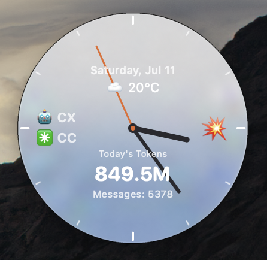

<div align="center">

[简体中文](README.zh-CN.md) · **English**

# 🕰️ TokenClock

**A beautiful, always-on-top desktop clock for tracking all your AI coding agents at a glance.**

[](https://github.com/Neo-Isshin/TokenClock/releases/latest)
[](#macos-and-linux)
[](#macos-and-linux)
[](#windows)
[](#macos-and-linux)

[](https://www.swift.org/)
[](LICENSE)
[](https://github.com/Neo-Isshin/TokenClock)

</div>

<div align="center">

<table>
  <tr>
    <td align="center" valign="bottom"><br><sub><b>Liquid Glass</b><br>macOS 26+ / 27 Native Fluid Glass</sub></td>
    <td align="center" valign="bottom"><br><sub><b>Usage Dropdown</b><br>Live session and model breakdown</sub></td>
    <td align="center" valign="bottom"><br><sub><b>Normal Edition</b><br>macOS / Windows 11 / Linux Native</sub></td>
  </tr>
</table>

</div>

---

**TokenClock** is a lightweight, always-on-top clock widget designed for engineers building with AI coding agents. While keeping precise time, it aggregates today's **token consumption, message volume, active AI tools, token velocity, and local weather** directly onto your desktop—eliminating the need to juggle between disjointed web dashboards.

- **Left-click the face:** instantly slide down granular session and model token breakdowns.
- **Right-click the face:** seamlessly switch between 8 bespoke clock themes, resize, set cities, timezones, transparency, and personal preferences.

---

## ✨ Features

- 🤖 **Unified Overview for 15+ AI Coding Tools**  
  Native support for OpenClaw, Claude Code, Gemini CLI, Codex, Hermes, OpenCode, Qwen Code, Copilot CLI, Grok CLI, Aider, Antigravity, Cline, Continue, Cursor Agent, and ZCode. Automatically detects local data stores without manual setup.
- 🔔 **Subscription Quota & Renewal Reminders (New in v1.5.11)**  
  Centralized quota gauges and reset timers for Codex, Cursor, Claude Code, Antigravity, Grok Bot, and Zhipu GLM. Features **automatic billing cycle discovery** for Codex/ChatGPT and Cursor, delivering alerts 1, 2, 3, or 7 days prior to renewal so you never get hit by unexpected subscription fees.
- 📈 **30-Day Historical Heatmap (Usage Overview)**  
  A GitHub-style calendar contribution heatmap and cumulative activity breakdown, allowing you to trace past consumption patterns, message frequencies, and API-equivalent expenses across all tools.
- 📊 **Honest, Accurate Token Accounting**  
  Accurately separates input, output, reasoning, and cache creation tokens. Prompt cache hits (read-only reuse) are excluded from the primary dial figure to avoid misleading spikes.
- 💳 **API-Equivalent Cost Translation**  
  Converts daily token consumption into an equivalent USD value according to LiteLLM's public pricing catalog with official provider overrides. Supports custom proxy pricing in Settings.
- 🎴 **Aesthetic Usage Share Cards**  
  Export beautiful, high-res usage summary cards with a single click to share your daily AI milestones on social media or team channels.
- 🎨 **8 Handcrafted Themes + Aurora Dynamic Glow**  
  Features Glass, Classic, Glacier, Midnight, Luxe, Antique, Railgun, and Sky themes, accompanied by smooth Aurora gradient animations and high-resolution brand iconography.
- ⚡ **True Native Engineering for Every Platform**  
  - **macOS:** SwiftUI + AppKit with full support for macOS 26+ Liquid Glass and menu-bar toggle.
  - **Windows:** Pure Win32 + Fluent UI with near-zero memory footprint, system tray support, and per-user non-admin installation.
  - **Linux:** GTK3 + Cairo prebuilt AppImage with automated FUSE2-free extraction fallback.
- 🔌 **Local Loopback API**  
  Exposes read-only JSON endpoints at `127.0.0.1:9988` for seamless integration into Raycast, GeekTool, Sketchybar, or shell scripts.
- 🔒 **100% Local-First & Zero Permission Friction**  
  Exclusively reads local files already created on your machine. **No code, sessions, or tokens are ever uploaded.** Weather uses approximate IP lookup—**never prompting for macOS/system location permissions**.

---

## 💻 Cross-Platform Support

| Platform | Edition | Requirements & Highlights |
|---|---|---|
| **macOS 26+** | Liquid Glass + Normal | Universal Apple Silicon / Intel binary, macOS 27 Beta 5 validated, fluid glass aesthetics |
| **macOS 12–25** | Normal | Classic floating desktop widget |
| **Windows 11 / 10** | Normal (Win32 Fluent) | x86_64, per-user non-admin install, system tray integration |
| **Linux** | Normal (GTK3 AppImage) | x86_64, glibc 2.35+, automatic fallback for environments without FUSE |

---

## ⚡ Quick Install

### macOS & Linux

Paste into Terminal:

```bash
curl -fsSL https://raw.githubusercontent.com/Neo-Isshin/TokenClock/main/cli/install.sh | bash
```

The installer detects your architecture, verifies cryptographic hashes, launches TokenClock, and configures the `tokenclock` CLI helper.

Common CLI commands:

```bash
tokenclock doctor     # Inspect runtime health and data sources
tokenclock restart    # Restart the desktop widget process
tokenclock update     # Check and upgrade to the latest stable release
tokenclock uninstall  # Remove application while optionally retaining settings
```

### Windows

Run this in PowerShell (no Administrator rights needed):

```powershell
& ([scriptblock]::Create((irm https://raw.githubusercontent.com/Neo-Isshin/TokenClock/main/cli/install.ps1)))
```

Installs into `%LOCALAPPDATA%\Programs\TokenClock` with automatic SHA256 integrity verification.

<details>
<summary><strong>🛠️ Optional Windows Install Flags</strong></summary>

```powershell
# Install without immediate launch, and pin to Start Menu
& ([scriptblock]::Create((irm https://raw.githubusercontent.com/Neo-Isshin/TokenClock/main/cli/install.ps1))) -NoStart -StartMenuShortcut

# Verify current installation state
& ([scriptblock]::Create((irm https://raw.githubusercontent.com/Neo-Isshin/TokenClock/main/cli/install.ps1))) -Action Check

# Uninstall while preserving your user preferences
& ([scriptblock]::Create((irm https://raw.githubusercontent.com/Neo-Isshin/TokenClock/main/cli/install.ps1))) -Action Uninstall
```

</details>

---

## 📸 Screenshots

<div align="center">

<h3>📊 30-Day Historical Heatmap & Analytics (Usage Overview)</h3>
<p></p>

<br>

<table>
  <tr>
    <td align="center" width="56%"><br><sub><b>🔔 Subscription Quotas & Renewal Reminders</b><br>Codex, Cursor, Grok Bot, Z.ai, Claude & more</sub></td>
    <td align="center" width="44%"><br><sub><b>🎨 8 Handcrafted Clock Faces (Theme Selector)</b><br>Classic, Glacier, Midnight, Luxe, Antique, Sky, etc.</sub></td>
  </tr>
</table>

</div>

---

## 🕹️ Everyday Interaction

- **Inspect Usage:** Left-click the dial to expand the dropdown detailing session and model metrics.
- **Change Perspectives:** Switch between **By Session** and **By Model**; click **By Percent** to sort consumption by ratio.
- **Quota & Renewal Dashboard:** Click **Subscription Quota** to review reset countdowns. Click the pencil icon next to any account to set custom renewal reminder days (1, 2, 3, or 7 days).
- **Inspect History:** Click **History Usage** to open the Usage Overview window with 30-day activity heatmaps and cumulative stats.
- **Settings & Customization:** Right-click the dial to open **Settings**:
  - Toggle data sources or customize paths under Data Source Paths;
  - Adjust update polling and high-velocity alert thresholds;
  - Enter custom prices for local/proxy model endpoints;
  - Create and save custom theme palettes.
- **Positioning & Quick Hide:**
  - Drag the clock anywhere on your desktop; position persists across reboots.
  - **macOS:** Click the menu bar gauge to instantly toggle visibility.
  - **Windows:** Select **Hide TokenClock** from the context menu to minimize to tray; click tray icon to restore.

---

## 🧩 Ecosystem Support

TokenClock automatically discovers and parses sessions from 15+ AI coding environments:

| Official / CLI Agents | Standalone IDEs & Agents | IDE Extensions & Frameworks |
|---|---|---|
| **Claude Code** | **Cursor Agent** | **Continue** |
| **OpenClaw** | **Antigravity** | **Cline** |
| **Codex** | **ZCode** | **Aider** |
| **Gemini CLI** | **Qwen Code** | **OpenCode** |
| **GitHub Copilot CLI** | **Grok CLI** | **Hermes** |

> Note: If an agent stores data in an unconventional path, simply map it under **Settings → Data Source Paths**. Windows builds also provide support for Kiro session probing and experimental CodeBuddy status.

---

## 🔌 Local REST API

TokenClock includes a read-only HTTP server binding strictly to `127.0.0.1` (external network connections are refused):

```bash
# Current usage, messages, and model breakdowns
curl http://127.0.0.1:9988/api/usage

# Historical 30-day usage trajectory
curl http://127.0.0.1:9988/api/history?days=30
```

Cost responses include the explicit `"costBasis": "api_equivalent_public_list"` indicator for reliable parsing by Raycast, GeekTool, or custom scripts.

---

## ❓ Troubleshooting (FAQ)

<details>
<summary><strong>Q: A tool shows zero token usage despite active work?</strong></summary>

1. Right-click the clock, open **Settings**, and click **Re-detect**.
2. Verify the tool has created at least one valid local session file on disk.
3. Check **Data Source Paths** to ensure the path corresponds to your actual installation directory.
</details>

<details>
<summary><strong>Q: Subscription Quota shows "Unavailable"?</strong></summary>

The quota monitor reuses local authenticated session credentials (e.g. Codex OAuth, Cursor local state). Ensure the relevant CLI/IDE is logged in on your machine. Certain enterprise SSO tenants or unpublished APIs may not return quota payloads.
</details>

<details>
<summary><strong>Q: Linux AppImage fails to launch?</strong></summary>

Run `tokenclock doctor` to inspect startup diagnostics. If your distribution lacks `libfuse2`, our latest installer automatically runs in unpack-and-run mode without requiring `sudo`.
</details>

<details>
<summary><strong>Q: Weather display is missing or incorrect?</strong></summary>

TokenClock looks up weather via IP approximation with `wttr.in`. If offline or firewalled, configure a specific city in **Settings → City**.
</details>

---

## 🛠️ Build from Source

```bash
git clone https://github.com/Neo-Isshin/TokenClock.git
cd TokenClock
swift build -c release
```

- **macOS:** Produces universal binaries supporting both Liquid Glass and Normal UI engines.
- **Windows:** Compiles using Swift 6 for Windows toolchain paired with Win32Shim.
- **Linux:** Built using Swift Package Manager with GTK3 dependencies.

---

## ⚖️ License & Acknowledgments

- Licensed under the **[MIT License](LICENSE)** — Copyright © 2026 Neo-Isshin.
- Thanks to the [Swift](https://www.swift.org/) team for cross-platform Swift advancements.
- Thanks to GTK and Cairo powering the Linux experience.
- Appreciation to all AI coding agent creators maintaining transparent local telemetry!
