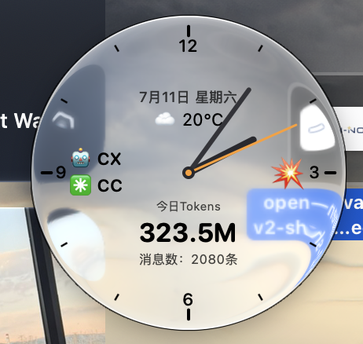
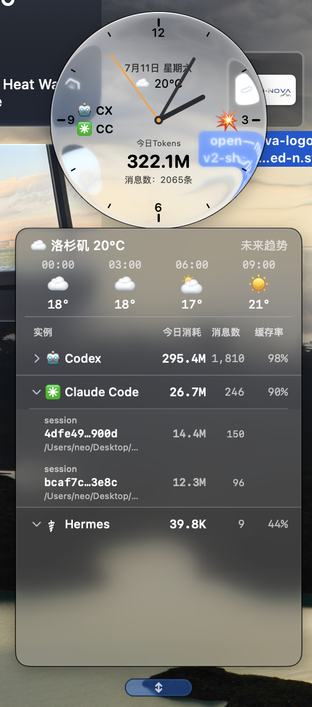
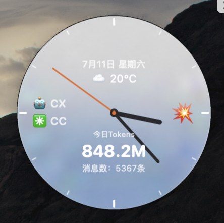
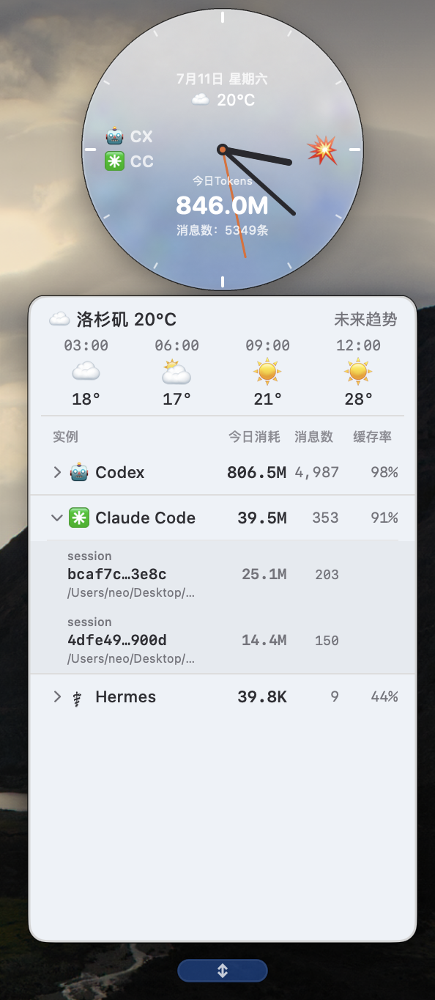
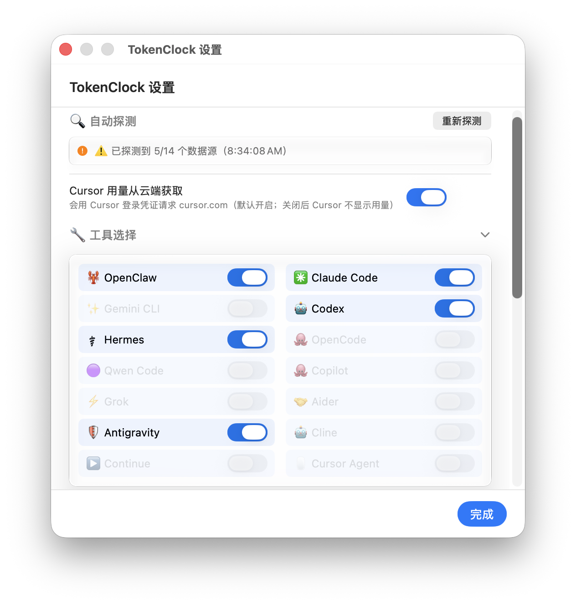
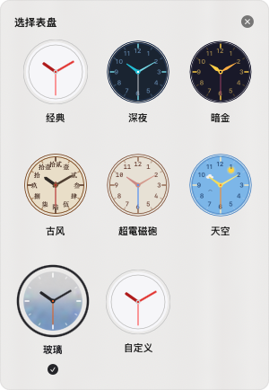
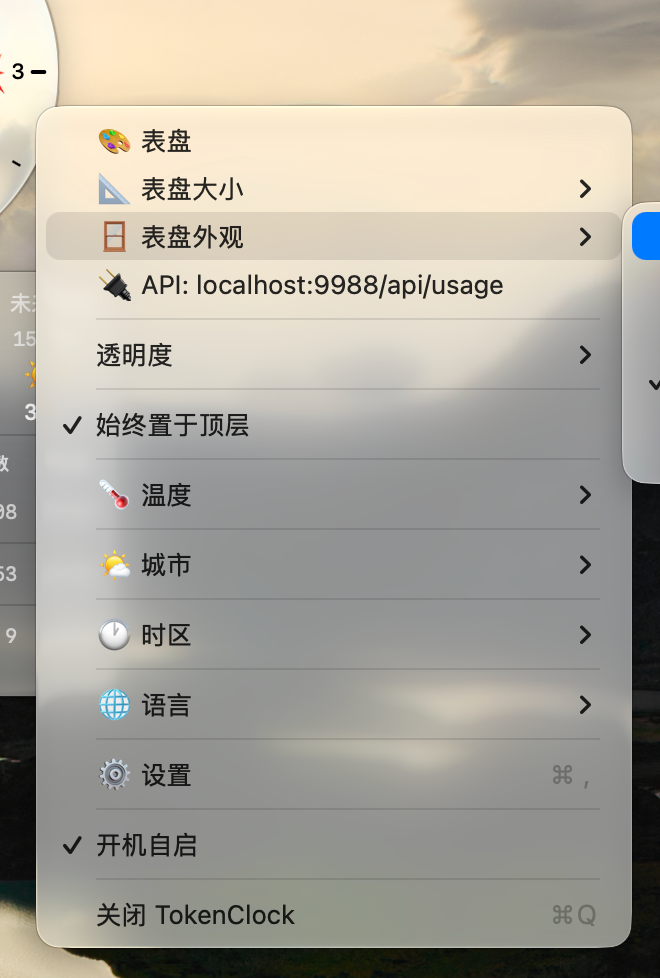
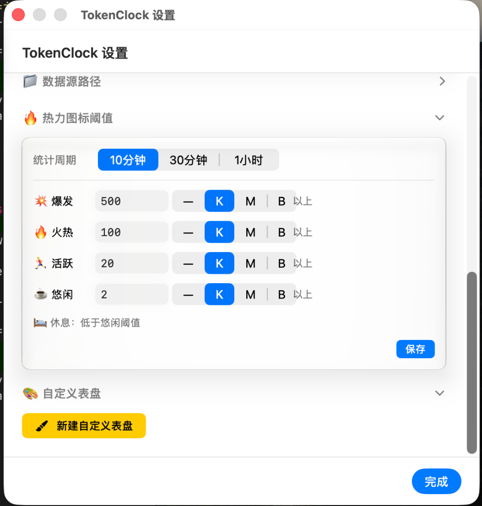

<div align="center">

**简体中文** · [English](README.md)

# 🕰️ TokenClock

**专为 AI 编程用量而生的原生 Liquid Glass 桌面时钟**

Claude Code、Codex、Antigravity(可区分IDE、CLI、App)、OpenCode 等 14 款工具的消耗，在一只流动的玻璃表盘上一目了然——**全部留在你的 Mac 上**。

[](https://www.apple.com/macos/)
[](https://developer.apple.com/macos/)

[](#-隐私)
[](LICENSE)
[](https://github.com/Neo-Isshin/TokenClock/releases)

</div>

<div align="center">



<sub><b>macOS 26+ 原生 Liquid Glass</b> · 随壁纸折射 · 氛围着色 · 自适应对比度 · 常驻桌面</sub>

</div>

---

## 🧊 Liquid Glass 是界面本身，不是一层玻璃风皮肤

TokenClock 把 macOS 26 原生 **Liquid Glass** 变成一件真正有用、抬眼可见的桌面仪表。玻璃盘体会折射身后的桌面，带上细腻的主题氛围色，并随壁纸明暗自动切换墨色对比度。可调毛玻璃底板让你在纯净通透与高可读性的厚实表盘之间自由选择，同时保留原生材质的质感。

它不是藏在另一个窗口里的 Dashboard，而是一件真正属于桌面的 **悬浮玻璃对象**：常驻置顶、自由拖拽、记忆位置，安静地陪在工作区旁边。

<div align="center">

**7 款玻璃表盘** · **透明度自由调节** · **完整主题编辑器** · **macOS 原生渲染**

</div>

## ⚡ 一行安装

安装器会在 macOS 26+ 自动选择原生 Liquid Glass 版，在 macOS 12–15 自动选择经典兼容版。

```bash
curl -fsSL https://raw.githubusercontent.com/Neo-Isshin/TokenClock/main/cli/install.sh | bash
```

表盘实时显示：**今日 token 消耗、消息条数、活跃 AI 工具、用量速率与天气**。点击即可从 **工具 → session / agent** 逐级下钻，看清 token 究竟花在了哪里。

TokenClock 只读取各 AI 编程工具已经保存在 Mac 上的本地日志，**不上传任何信息**。

> [!NOTE]
> Liquid Glass 版已支持 macOS 27 beta 3，但可能随 beta 版本更新而失效。
---

## 📑 目录

- [🌟 核心优势](#-核心优势)
- [✨ 特性](#-特性)
- [📸 截图](#-截图)
- [🤖 支持的 AI 工具](#-支持的-ai-工具)
- [🚀 快速开始](#-快速开始) —— [一行安装](#一键安装最简单) · [`tokenclock` CLI](#使用-tokenclock-cli)
- [🎨 主题](#-主题)
- [🧊 液态玻璃（Liquid Glass）](#-液态玻璃liquid-glass)
- [🔌 本地 API 服务器](#-本地-api-服务器)
- [🔒 隐私](#-隐私)
- [🛣 未来支持计划](#-未来支持计划)
- [📦 技术栈](#-技术栈)
- [📄 许可证](#-许可证)
- [🙏 致谢](#-致谢)

---

## 🌟 核心优势

<table>
  <tr>
    <td width="50%" valign="top"><b>🧊 原生 Liquid Glass</b><br><sub>随身后壁纸实时折射的玻璃盘体，带氛围着色与自适应高对比墨色，真正融入桌面。</sub></td>
    <td width="50%" valign="top"><b>🎨 属于你自己的玻璃</b><br><sub>7 款内置表盘、可调毛玻璃底板，以及玻璃着色、指针、刻度、数字、字体、尺寸和窗口透明度。</sub></td>
  </tr>
  <tr>
    <td valign="top"><b>🤖 多工具总览，一屏尽览</b><br><sub>把 <b>14 款</b> AI 编程工具的 token / 消息用量汇聚到同一只表盘，告别多终端、多后台来回切换。</sub></td>
    <td valign="top"><b>🔍 分 session / agent 下钻</b><br><sub>从工具级总览一路深入到每条 session / agent 明细，立刻看清消耗花在哪、是哪段对话烧的。</sub></td>
  </tr>
  <tr>
    <td valign="top"><b>🌤️ 常驻桌面，零打扰</b><br><sub>抬眼即知实时消耗与速率（🔥 爆发 / 🌊 平稳），不打开窗口、不打断编码节奏。</sub></td>
    <td valign="top"><b>📜 历史用量可回溯</b><br><sub>每日快照存入本地 SQLite（保留 30 天），经本地 API 暴露，可回溯过往、对接你自己的图表。</sub></td>
  </tr>
  <tr>
    <td valign="top"><b>⚡ 性能占用极低</b><br><sub>原生 Swift + 高效轮询（时钟 1s / 用量 30s / 天气 5min）+ 流式 JSONL，常驻后台几乎无感。</sub></td>
    <td valign="top"><b>🔒 纯本地，零上传</b><br><sub>只读各工具本地日志，不上传任何数据；API 仅监听 <code>127.0.0.1</code> 回环。</sub></td>
  </tr>
  <tr>
    <td colspan="2" valign="top"><b>🔌 零配置，开箱即用</b><br><sub>首次启动自动探测本机已安装的 14 款 AI 编程工具。对于无历史数据的全新工具，在使用产生日志后亦能被后台动态感知开启，无需手动配置。</sub></td>
  </tr>
</table>

---

## ✨ 特性

### 🤖 多 AI 工具统一实时检测
- 自动探测并读取 **14 款 AI 编程工具** 写入本地的 token / 消息用量日志并统一聚合。
- 表盘上叠加 **今日总量、活跃工具图标、速率 emoji**（🔥 爆发 / 🌊 平稳阈值）。
- 点击展开 **下拉面板** 查看明细（工具 → session / agent 两级下钻，详见[核心优势](#-核心优势)）。

### 🧊 液态玻璃（Liquid Glass）& 精心设计
- macOS 26 上以原生 **Liquid Glass** 材质渲染，玻璃盘体随壁纸自适应、带氛围着色、折射与流动。
- **自适应高对比墨色文字**：浅色 tint 主题自动切换近黑刻度 / 数字，保证可读性。
- 提供 `main`（macOS 26）与 `normal`（macOS 12）**双版本**，由 `tokenclock` CLI 按系统版本自动选用。

### 📦 一行安装 & CLI
- `normal` 适用于 **macOS 12+**，液态玻璃适用于 **macOS 26+**。一行安装脚本会根据系统自动选变体，简单的 `tokenclock` CLI 即可启动 / 停止 / 切换 / 诊断。详见 [安装指南](https://github.com/Neo-Isshin/TokenClock)。

### 🎨 多表盘 + 美观设计 + 支持深度自定义
- 7 款内置表盘（经典 / 冰川 / 深夜 / 暗金 / 古风 / 超电磁炮 / 天空），风格各异。
- 4 种指针样式（圆头 / 锥形 / 菱形 / 剑形），数字风格含阿拉伯数字与中文数字。
- **完全自定义主题**：表盘色、玻璃着色、三根指针、刻度、数字、边框颜色与字体全部可调。

### ⚙️ 其他
- 实时时钟（1s）、用量刷新（30s）、天气（5min）。
- 天气与 12 小时预报（IP 自动定位或手动选城市）；8 个时区。
- 国际化：**简体中文 / 繁体中文 / English**。
- 置顶 · 可拖拽 · 跨重启位置记忆；开机自启动（`SMAppService`）。
- 本地 API 服务器（`:9988`），供集成 / 脚本调用。
- 隐私优先：**全部数据本地读取，零上传**。

---

## 📸 截图

### 🧊 Liquid Glass 版预览（macOS 26+）

<table>
  <tr>
    <td width="50%" align="center"><b>悬浮液态玻璃时钟</b><br><sub>玻璃盘体随壁纸折射 · 叠加 token / 消息 / 速率 / 天气</sub></td>
    <td width="50%" align="center"><b>总览</b><br><sub>玻璃时钟与展开面板同框</sub></td>
  </tr>
  <tr>
    <td width="50%" align="center"></td>
    <td width="50%" align="center"></td>
  </tr>
</table>

### ⬜ Normal 版预览（macOS 12+）

<table>
  <tr>
    <td width="50%" align="center"><b>悬浮时钟</b><br><sub>经典不透明表盘 · 叠加 token / 消息 / 速率 / 天气</sub></td>
    <td width="50%" align="center"><b>总览</b><br><sub>不透明时钟与展开面板同框</sub></td>
  </tr>
  <tr>
    <td width="50%" align="center"></td>
    <td width="50%" align="center"></td>
  </tr>
</table>

### ⚙️ 功能设置预览

<table>
  <tr>
    <td width="44%" align="center"><b>功能设置面板</b><br><sub>自动探测工具路径与详细参数配置</sub></td>
    <td width="34%" align="center"><b>表盘主题选择器</b><br><sub>7 款内置表盘与完全自定义配置</sub></td>
    <td width="22%" align="center"><b>右键快捷菜单</b><br><sub>快速调整表盘、尺寸与常用设置</sub></td>
  </tr>
  <tr>
    <td align="center"></td>
    <td align="center" rowspan="2" valign="middle"></td>
    <td align="center" rowspan="2" valign="middle"></td>
  </tr>
  <tr>
    <td align="center"></td>
  </tr>
</table>

---

## 🤖 支持的 AI 工具

TokenClock 通过读取各工具在本地写入的 **JSONL / SQLite 用量文件** 进行统计（路径优先级：自定义路径 > 环境变量 > 默认路径，首启时自动探测）。下表为默认数据源与对应环境变量。

| 工具 | 默认数据源 | 环境变量 |
|------|-----------|---------|
| **OpenClaw** | `~/.openclaw/` | `OPENCLAW_HOME` |
| **Claude Code** | `~/.claude/` | `CLAUDE_CONFIG_DIR` |
| **Gemini CLI** | `~/.gemini/` | `GEMINI_HOME` |
| **Codex** | `~/.codex/` | `CODEX_HOME` |
| **Hermes** | `~/.hermes/` | `HERMES_HOME` |
| **OpenCode** | `~/.local/share/opencode/` | `OPENCODE_HOME` |
| **Qwen Code** | `~/.qwen/` | `QWEN_HOME` |
| **GitHub Copilot CLI** | `~/.copilot/` | `COPILOT_HOME` |
| **Grok CLI** | `~/.grok/` | `GROK_HOME` |
| **Aider** | `~/.aider/analytics.jsonl` | `AIDER_HOME` |
| **Antigravity** | `~/.gemini/antigravity-cli/` | `ANTIGRAVITY_HOME` |
| **Cline**（VSCode 扩展） | `~/Library/Application Support/Code/User/globalStorage/saoudrizwan.claude-dev/` | `CLINE_HOME` |
| **Continue**（VSCode 扩展） | `~/.continue/` | `CONTINUE_HOME` |
| **Cursor Agent** | `~/.cursor/` | `CURSOR_AGENT_HOME` |

> 各服务的 token 计算公式略有差异：**Codex、Gemini/Qwen** 的 `input`（`promptTokenCount`）已含 cached，不能再加 cached（否则双计），用 `input + output + (thought)`；其余服务（Claude/OpenClaw 等）的输入/输出/缓存字段互斥相加。详见 `docs/TOOL_SCHEMA_ANALYSIS.md`。

---

## 🚀 快速开始

### 一键安装（最简单）

自动检测 macOS 版本 → **下载预编译**对应变体（universal，SHA256 校验 + 去隔离）→ 安装到 `~/.tokenclock` → 把 `tokenclock` 加入 PATH → 首次启动并扫描各 AI 工具的本地路径，全程无需手动干预。下载失败或加 `--build-from-source` 才回退本地编译。

> 💡 **下载即用** —— 无需 Xcode、无需 $99/年公证：自动下载预编译 universal 二进制（SHA256 校验 + 去隔离），普通用户开箱即用。

```bash
# 一行安装（推荐）：
curl -fsSL https://raw.githubusercontent.com/Neo-Isshin/TokenClock/main/cli/install.sh | bash

# 已克隆本仓库时也可直接运行：
./cli/install.sh
```

可选参数：`--normal` / `--glass`（指定变体）/ `--no-start`（装完不自动启动）/ `--build-from-source`（强制本地编译）/ `--check`（仅检查不安装）/ `--debug`（debug 构建）。

> 也可手动从源码构建，见下方。

### 前置要求
- **macOS 12+**（普通版）；**macOS 26+**（Liquid Glass 版）
- 预编译安装**无需任何工具链**；仅 `--build-from-source` 本地编译时需要 Swift 6（Xcode 16+ / Command Line Tools）

### 从源码构建运行

```bash
git clone https://github.com/Neo-Isshin/TokenClock.git TokenClock
cd TokenClock

# 调试构建并直接运行
swift run

# 或先构建再运行
swift build            # 调试
swift build -c release # 发布
.build/debug/TokenClock      # 或 .build/release/TokenClock
```

> `main` 分支的 `Package.swift` 声明为 `.macOS(.v26)`，`swift run` 直接产出 Liquid Glass 版；兼容 macOS 12 的经典（不透明）版本位于 `normal` 分支。

> 小坑：在 **macOS 27 且只装了 Command Line Tools**（无完整 Xcode）的机器上，`main` 分支裸 `swift build` 会因 27 SDK 把 `@State` 宏化而失败；指定 `SDKROOT=/Library/Developer/CommandLineTools/SDKs/MacOSX26.sdk swift build` 即可（26 SDK 里 `@State` 仍是普通属性包装器）。`normal` 分支不受影响。

### 使用 `tokenclock` CLI

将轻量 shell 脚本安装到 PATH：

```bash
sudo install -m755 cli/tokenclock /usr/local/bin/tokenclock
```

| 命令 | 说明 |
|------|------|
| `tokenclock start [--glass\|--normal] [--force]` | 启动时钟；未指定版本时 **按系统版本自动选**（26+ → glass，12+ → normal）；`--force` 强制另开一份 |
| `tokenclock stop` | 停止所有运行中的 TokenClock 实例 |
| `tokenclock restart [--glass\|--normal]` | 重启 |
| `tokenclock doctor` | 诊断环境：系统版本、已安装变体路径、运行中的进程、环境变量 |
| `tokenclock update [--check] [--force]` | 更新到最新版：拉取最新 install.sh → SHA256 校验 → 装新二进制 → 重启（无变更则不动）；`--check` 仅检查，`--force` 强制 |
| `tokenclock help` | 显示帮助 |

**变体定位顺序**：`$TOKENCLOCK_GLASS` / `$TOKENCLOCK_NORMAL` 环境变量 → `~/.tokenclock/` → `/Applications/` → 仓库 `.build/debug/`。

---

## 🎨 主题

7 款内置表盘，外加完全自定义：

| 主题 | 中文名 | 性格 |
|------|--------|------|
| `classic`  | 经典     | 纯净玻璃盘 · 炭黑指针 + 琥珀秒针 · 仅 3/6/9/12 数字 |
| `glacier`  | 冰川     | 清透冰蓝玻璃 · 墨色剑形指针 + 樱粉秒针 · 冰蓝色刻度与数字 |
| `midnight` | 深夜     | 青色玻璃 · 青色锥形指针 |
| `luxe`     | 暗金     | 金色玻璃 · 金色菱形指针 |
| `gufeng`   | 古风     | 暖棕玻璃 · 墨色剑形指针 · **中文数字** |
| `railgun`  | 超电磁炮 | 粉橙玻璃 · 电弧蓝秒针 · 等宽字体 |
| `sky`      | 天空     | 蓝色玻璃 · 阳光白云 · 金色指针 |
| `custom`   | 自定义   | 玻璃着色 / 三根指针 / 刻度 / 数字 / 字体……全部可调 |

在时钟上 **右键** → 主题选择器，或打开设置窗口中的主题编辑器即可切换 / 自定义。

---

## 🧊 液态玻璃（Liquid Glass）

TokenClock 提供两套构建：

| 分支 | 目标系统 | 渲染 |
|------|---------|------|
| `main`   | **macOS 26+** | 原生 Liquid Glass 材质，玻璃盘体随壁纸自适应、带氛围着色 |
| `normal` | macOS 12+     | 经典不透明主题表盘，向前兼容 |

- 玻璃表盘采用 **氛围着色（glass tint）** 取代旧版不透明底色：纯净玻璃基础上叠加主题提示色，保留各表盘个性又不遮挡壁纸。
- **可调毛玻璃底板**：清透折射玻璃下层叠加一层公开毛玻璃底板，透明度 0–100% 五档可调（0 = 纯净玻璃通透，100 = 实心底板），在通透与实心之间自由拿捏（仅 macOS 26 液态玻璃版）。
- 浅色 tint 主题（暗金 / 超电磁炮 / 天空）自动使用 **高对比近黑墨色** 文字、刻度与数字；深 / 中 tint 主题（经典 / 深夜 / 古风）使用纯白。
- `tokenclock` CLI 会根据 `sw_vers` 主版本号自动选用匹配变体，无需手动判断。

---

## 🔌 本地 API 服务器

TokenClock 在本地启动一个 `NWListener` HTTP 服务器：

```
GET http://127.0.0.1:9988/api/usage          # 实时聚合用量（今日总量 / 各工具 / session 明细）
GET http://127.0.0.1:9988/api/history?days=30 # 过去 N 天的日结快照（最多 30 天，便于画趋势）
```

返回 JSON 用量数据，便于外部脚本 / 仪表盘集成。仅监听本机回环，**不会对外暴露**。

---

## 🔒 隐私

- 所有用量数据均 **在本地读取** 自各 AI 工具自身写入的日志文件——TokenClock **不上传任何 token / 会话信息**。
- 本地 API 服务器仅监听 `127.0.0.1`，且为可选项。
- 天气功能通过 IP 大致定位或手动选择城市获取，仅用于显示当前天气与预报。

---

## 🛣 未来支持计划

- [ ] 支持更多 AI 编程工具（持续扩展检测器）
- [ ] 提供签名 / 公证的 release 构建（`.app`）—— 当前走未签名 GitHub 分发，此项需 Apple Developer 账号（$99/年），暂不计划，欢迎赞助 / 认领
- [ ] 更丰富的历史统计与图表

---

## 📦 技术栈

| | |
|---|---|
| **语言** | Swift 6（`-parse-as-library`） |
| **UI** | SwiftUI + AppKit（无锁 NSPanel 双窗口架构） |
| **构建** | Swift Package Manager（无 `.xcodeproj`） |
| **平台** | macOS 26 SDK（`main` 分支）/ macOS 12 SDK（`normal` 分支） |
| **定位** | 自研 `L10n` 引擎（zh-Hans / zh-Hant / en，无 `.xcstrings`） |
| **规模** | 约 12,400 行 Swift |

---

## 📄 许可证

TokenClock 基于 **[MIT 协议](LICENSE)** 开源 —— © 2026 Neo-Isshin。您可以自由使用、分发与修改，亦可用于商业或闭源项目，仅需保留版权与许可声明。

---

## 🙏 致谢

- TokenClock 的诞生得益于众多优秀的 AI 编程工具及其社区。感谢这些工具将 token 用量写入本地日志，使统一可视化成为可能。  

- 本项目的液态玻璃折射效果（macOS 26+）得益于对 macOS 私有 API `NSGlassEffectView` 的逆向研究，特别致谢首创探索该私有 API 的开源项目 **[electron-liquid-glass](https://github.com/Meridius-Labs/electron-liquid-glass)**（由 Meridius-Labs 维护）。

- 表盘设计灵感来自传统机械腕表与流行文化（古风 / 超电磁炮主题）。
---

<div align="center">

<h3>⭐ 觉得 TokenClock 好用？</h3>

**欢迎给项目一个 Star —— 你的支持是持续迭代的动力 🚀**

[](https://github.com/Neo-Isshin/TokenClock)

</div>
