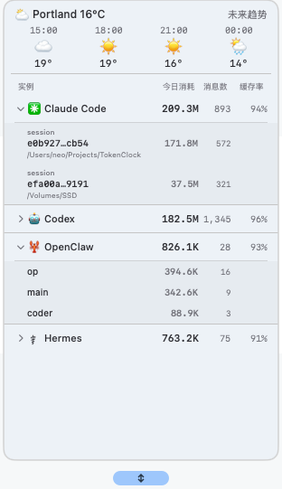

<div align="center">

**简体中文** · [English](README.md)

# 🕰️ TokenClock

**一眼看清所有 AI 编程工具消耗的桌面时钟。**

[](#macos-与-linux)
[](#macos-与-linux)
[](#macos-与-linux)
[](#windows)
[](#macos-与-linux)

[](https://www.swift.org/)
[](LICENSE)
[](https://github.com/Neo-Isshin/TokenClock/releases)

</div>

<div align="center">

<table>
  <tr>
    <td align="center"><br><sub><b>Liquid Glass</b> · macOS 26+</sub></td>
    <td align="center"><br><sub><b>Normal</b> · macOS、Windows、Linux</sub></td>
  </tr>
</table>

</div>

TokenClock 是一个置顶显示在桌面的小时钟。除了时间，它还会显示今天用了多少 token、发送了多少条消息、哪些 AI 工具正在工作、当前使用速度和天气，让你不必在多个面板之间来回切换。

左键点击表盘即可查看会话与模型明细；右键可以切换表盘、尺寸、城市、时区、语言、透明度和其他设置。

## 你会得到什么

- **14 种 AI 编程工具统一统计。** TokenClock 会自动寻找本地用量数据；路径特殊时也能在设置中手动选择。
- **主用量更接近真实消耗。** 重复读取的提示词缓存不会抬高主数字；新输入、缓存创建、输出和推理仍会正常计入。
- **8 套精心设计的表盘。** Glass、Classic、Glacier、Midnight、Luxe、Antique、Railgun、Sky，并支持保存自定义表盘。
- **不用离开桌面就能看明细。** 可按会话或模型分组、展开单行，并按百分比比较各工具消耗。
- **Codex 剩余额度。** 打开 Codex Quota 即可查看额度窗口和重置时间；只有打开时才会查询。
- **不会弹出系统定位授权。** 自动天气通过公网 IP 大致判断城市，也可以自己选择城市。
- **各平台保留原生体验。** macOS 使用 SwiftUI/AppKit，Windows 使用 Win32，Linux 使用 GTK3；工作流程一致，控件外观遵循各自系统。

## 支持平台

| 平台 | 版本 | 说明 |
|---|---|---|
| macOS 26+ | Liquid Glass + Normal | Apple 芯片与 Intel 通用版本，已支持 macOS 27 Beta 5 |
| macOS 12–25 | Normal | 经典不透明桌面小组件 |
| Windows 11 x86_64 | Normal | 当前用户安装，无需管理员权限 |
| Linux x86_64 | Normal | 预编译 GTK3 AppImage，要求 glibc 2.35+ |

## 安装

### macOS 与 Linux

复制到终端运行：

```bash
curl -fsSL https://raw.githubusercontent.com/Neo-Isshin/TokenClock/main/cli/install.sh | bash
```

安装器会自动选择正确版本、校验下载文件、启动 TokenClock，并安装一个轻量的 `tokenclock` 管理命令。

安装后常用命令：

```bash
tokenclock doctor
tokenclock restart
tokenclock update
tokenclock uninstall
```

如果 Linux 无法打开 AppImage，请安装 `libfuse2`；Ubuntu 24.04+ 对应的软件包名为 `libfuse2t64`。

### Windows

复制到 PowerShell 运行：

```powershell
irm https://raw.githubusercontent.com/Neo-Isshin/TokenClock/windows-port/cli/install.ps1 | iex
```

TokenClock 会安装到当前用户的 `%LOCALAPPDATA%\Programs\TokenClock`，下载后自动校验文件。默认不会创建快捷方式，也不会启用开机自启。

Windows 可能会对尚未签名的首个版本显示信誉提示。继续前请确认来源是本仓库。

<details>
<summary>Windows 安装器的可选用法</summary>

```powershell
# 安装后不立即启动，并创建开始菜单快捷方式
& ([scriptblock]::Create((irm https://raw.githubusercontent.com/Neo-Isshin/TokenClock/windows-port/cli/install.ps1))) -NoStart -StartMenuShortcut

# 查看当前安装状态
& ([scriptblock]::Create((irm https://raw.githubusercontent.com/Neo-Isshin/TokenClock/windows-port/cli/install.ps1))) -Action Check

# 卸载程序，但保留个人设置
& ([scriptblock]::Create((irm https://raw.githubusercontent.com/Neo-Isshin/TokenClock/windows-port/cli/install.ps1))) -Action Uninstall
```

</details>

## 日常使用

- **左键点击表盘：** 展开或收起用量详情。
- **Codex Quota：** 查看 Codex 剩余额度和重置时间。
- **By Session / By Model：** 切换会话或模型分组。
- **By Percent：** 比较各工具的消耗占比。
- **点击详情行：** 展开对应会话或模型。
- **右键点击表盘：** 打开表盘、尺寸、显示设置、刷新、Settings、About 和退出菜单。
- **拖动表盘：** 放到桌面任意位置；下次启动会记住位置。

Settings 中可以重新探测工具、开关数据源、修改路径、调整速率阈值、设置本地 API，以及创建自定义表盘。不同平台的设置行可能略有差异。

## 支持的工具

| | | |
|---|---|---|
| OpenClaw | Claude Code | Gemini CLI |
| Codex | Hermes | OpenCode |
| Qwen Code | GitHub Copilot CLI | Grok CLI |
| Aider | Antigravity | Cline |
| Continue | Cursor Agent | |

多数工具不需要额外配置。如果某个工具把数据放在特殊位置，请打开 **Settings → Data Source Paths**，选择对应文件夹或文件。

## 截图

<div align="center">

<table>
  <tr>
    <td align="center"><br><sub>用量详情</sub></td>
    <td align="center"><br><sub>表盘选择器</sub></td>
    <td align="center"><br><sub>Normal 版</sub></td>
  </tr>
</table>

</div>

## 隐私

- Token 与会话总量来自各 AI 工具已经保存在本机的文件；TokenClock 不会上传这些日志或统计结果。
- 可选的本地 API 只监听 `127.0.0.1`。
- 自动天气会访问天气/IP 服务来大致判断城市，但不会申请 macOS 系统定位权限。
- Codex Quota 只在打开额度面板时运行，通过本机已安装的 Codex app-server 查询限制；不会读取或修改 Codex 认证文件。
- Cursor 云端用量查询是可选功能。开启后会使用 Cursor 已保存的凭据访问 Cursor 服务；只想使用本地数据时可以保持关闭。

## 本地 API（可选）

TokenClock 可以为个人脚本和仪表盘提供只读 JSON：

```text
http://127.0.0.1:9988/api/usage
http://127.0.0.1:9988/api/history?days=30
```

服务只监听本机回环地址，其他电脑不能直接连接。

## 常见问题

- **某个工具一直是 0：** 在 Settings 中点击 Re-detect，再检查 Data Source Path。该工具至少要先产生一个本地会话。
- **Codex Quota 不可用：** 确认 Codex 已安装并登录，然后在额度面板中重试。
- **天气不可用：** 手动选择城市，或检查当前网络能否访问 `wttr.in`。
- **Linux AppImage 无法启动：** 安装 `libfuse2`/`libfuse2t64` 后重试。
- **CPU 占用异常：** 更新并重启 TokenClock。新版本已避免反复扫描旧 Codex 与 Gemini 历史。
- **仍然无法解决：** macOS/Linux 可运行 `tokenclock doctor`，也可以在 [GitHub Issues](https://github.com/Neo-Isshin/TokenClock/issues) 中附上系统和 TokenClock 版本。

## 从源码构建

普通用户建议使用上面的安装命令。开发者可以：

```bash
git clone https://github.com/Neo-Isshin/TokenClock.git
cd TokenClock
swift build -c release
```

各渠道独立维护：`main` 对应 macOS Liquid Glass，`normal` 对应经典 macOS，Linux 和 `windows-port` 使用各自的平台分支。平台专属路径和界面代码不会混入其他渠道。

## 许可证

TokenClock 基于 **[GPL v3 协议](LICENSE)** 开源 —— © 2026 Neo-Isshin。

## 致谢

- [Swift](https://www.swift.org/) 与 SwiftUI/AppKit
- Linux normal 使用的 GTK 与 Cairo
- 提供本地数据格式的各款 AI 编程工具
- 所有参与反馈、测试新平台和改进 TokenClock 的用户
