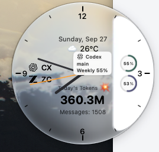
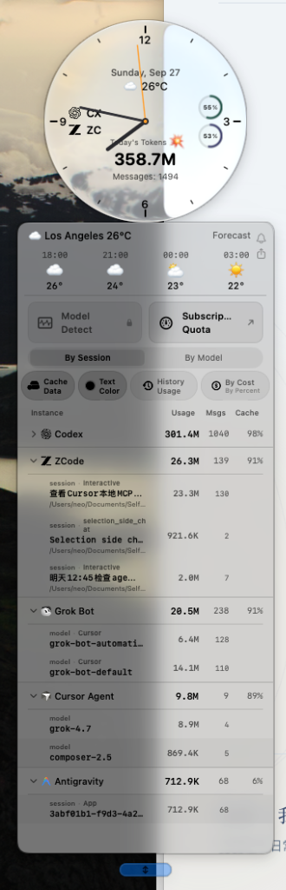
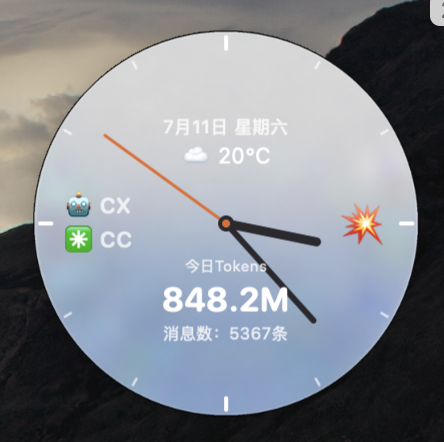
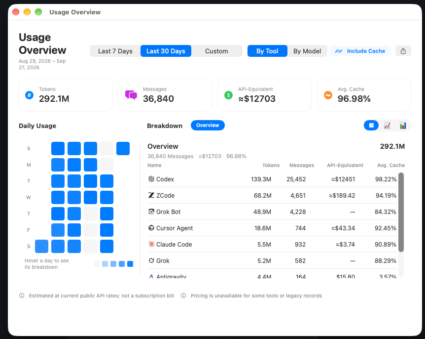
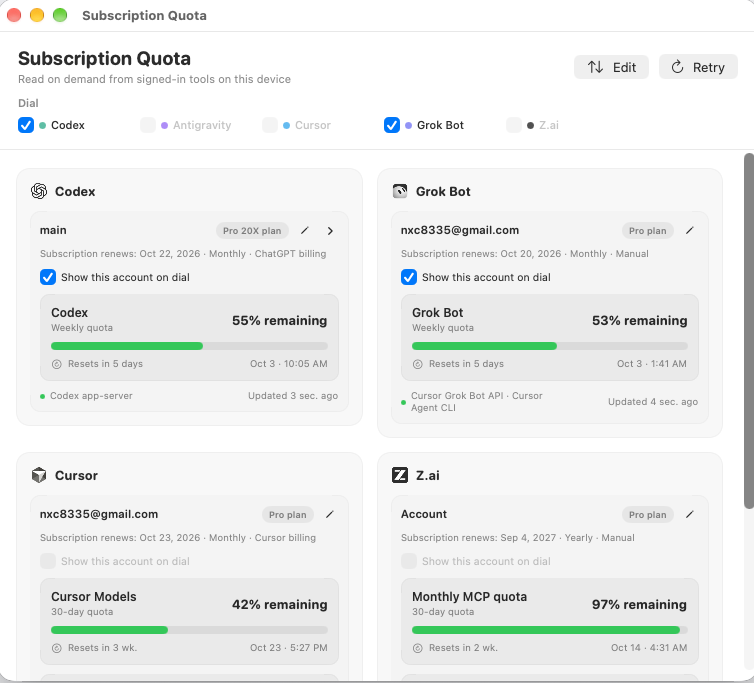
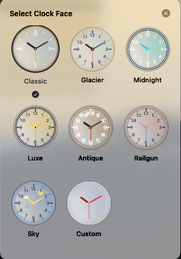

<div align="center">

**简体中文** · [English](README.md)

# 🕰️ TokenClock

**一眼看清所有 AI 编程工具消耗的极简桌面时钟。**

[](https://github.com/Neo-Isshin/TokenClock/releases/latest)
[](#macos-与-linux)
[](#macos-与-linux)
[](#windows)
[](#macos-与-linux)

[](https://www.swift.org/)
[](LICENSE)
[](https://github.com/Neo-Isshin/TokenClock)

</div>

<div align="center">

<table>
  <tr>
    <td align="center" valign="bottom"><br><sub><b>Liquid Glass</b><br>macOS 26+ / 27 原生流体玻璃</sub></td>
    <td align="center" valign="bottom"><br><sub><b>实时详情面板</b><br>会话/模型下钻与实时用量</sub></td>
    <td align="center" valign="bottom"><br><sub><b>Normal 版</b><br>macOS / Windows 11 / Linux 原生控件</sub></td>
  </tr>
</table>

</div>

---

**TokenClock** 是一个常驻桌面置顶的精致小时钟。它不仅静默走时，更会在方寸之间聚合你今日所有 AI 编程工具的 **Token 消耗、消息频次、正在工作的 Agent 工具、Token 速率与当前天气**。无需频繁切出窗口打开各种复杂的用量控制台，抬头即可了然于心。

- **左键点击表盘**：即刻滑出当日各工具会话、模型调用明细与耗费占比。
- **右键点击表盘**：自由切换 8 款精致表盘、缩放尺寸、调整城市时区、透明度与偏好设置。

---

## ✨ 核心特性

- 🤖 **统一纳管 15+ 种主流 AI 编程工具**  
  原生支持 OpenClaw、Claude Code、Gemini CLI、Codex、Hermes、OpenCode、Qwen Code、Copilot CLI、Grok CLI、Aider、Antigravity、Cline、Continue、Cursor Agent、ZCode。自动侦测本地数据源，免去复杂配置。
- 🔔 **订阅额度看板与续费提醒 (v1.5.11 新增)**  
  集中查看 Codex、Cursor、Claude Code、Antigravity、Grok Bot 与智谱 GLM 的额度余量与重置时间。针对 Codex/ChatGPT 与 Cursor 支持**自动识别账单周期**，并在续费前 1 / 2 / 3 / 7 天弹出通知提醒，告别意外扣费。
- 📈 **30 天历史全景与热力图 (Usage Overview)**  
  提供如同 GitHub 贡献日历般的历史用量热力图，回溯任意日期的消耗分布、各工具调用频次与等价成本轨迹。
- 📊 **真实有效的 Token 计算模型**  
  科学区分输入、输出、推理与缓存创建 Token。针对重复读取的提示词缓存（Prompt Cache Hit）自动剔除，避免虚标膨胀，反映最真实的开发消耗。
- 💳 **公开 API 等价费用折算**  
  根据 LiteLLM 定期更新的公网牌价与官方覆盖字典，将当日 Token 消耗透明换算为等价美元参考价值（非订阅账单金额）；支持在设置中为第三方中转/自定义代理模型自定义单价。
- 🎴 **精美用量分享卡片 (Usage Share Card)**  
  一键生成极具设计感的高清用量与成就分享卡，方便在社交网络或团队频道中展示你的每日 AI 生产力。
- 🎨 **8 款设计表盘与极光光晕**  
  提供 Glass、Classic、Glacier、Midnight、Luxe、Antique、Railgun、Sky 风格，配合平滑的 Aurora 动态极光渐变，兼顾实用与视觉愉悦。
- ⚡ **全平台深度原生实现**  
  - **macOS**：SwiftUI + AppKit，支持 macOS 26+ 原生 Liquid Glass 特效与菜单栏一键隐藏。
  - **Windows**：纯 Win32 + Fluent 原生渲染，极低内存开销，支持系统托盘常驻，单用户免管理员权限安装。
  - **Linux**：GTK3 + Cairo 预编译 AppImage，内置免 FUSE2 解包容灾，开箱即用。
- 🔌 **本地 Loopback API**  
  提供 `127.0.0.1:9988` 只读 REST 接口，轻松接入 Raycast、GeekTool、Sketchybar 或自动化脚本。
- 🔒 **100% 隐私安全与零权限骚扰**  
  仅只读解析本机现有日志，**绝不上传任何代码、Session 或 Token**；天气查询通过公网 IP 粗略定位，**绝不触发系统的弹窗定位权限申请**。

---

## 💻 跨平台支持

| 平台 | 版本形态 | 运行要求与特性 |
|---|---|---|
| **macOS 26+** | Liquid Glass + Normal | Apple Silicon / Intel 通用架构，支持 macOS 27 Beta 5，原生毛玻璃与流体光泽 |
| **macOS 12–25** | Normal | 经典独立桌面悬浮小组件 |
| **Windows 11 / 10** | Normal (Win32 Fluent) | x86_64 架构，免管理员提权，当前用户独立安装，集成系统托盘 |
| **Linux** | Normal (GTK3 AppImage) | x86_64 架构，要求 glibc 2.35+，无 FUSE 环境自动兼容解包运行 |

---

## ⚡ 极速安装

### macOS 与 Linux

打开终端（Terminal），直接运行官方一键脚本：

```bash
curl -fsSL https://raw.githubusercontent.com/Neo-Isshin/TokenClock/main/cli/install.sh | bash
```

安装器会自动识别当前系统架构、校验 Release 构件哈希、启动 TokenClock，并注册 `tokenclock` CLI 管理命令。

常用管理指令：

```bash
tokenclock doctor     # 检查运行状态与数据源健康度
tokenclock restart    # 重启桌面时钟进程
tokenclock update     # 检查并更新到最新发布版
tokenclock uninstall  # 卸载程序（可保留个人设置）
```

### Windows

在 PowerShell 中执行以下安装命令（无需管理员权限）：

```powershell
& ([scriptblock]::Create((irm https://raw.githubusercontent.com/Neo-Isshin/TokenClock/main/cli/install.ps1)))
```

程序将安全部署至 `%LOCALAPPDATA%\Programs\TokenClock` 并自动校验 SHA256。

<details>
<summary><strong>🛠️ Windows 高阶安装参数</strong></summary>

```powershell
# 安装时不立即启动，并在开始菜单创建快捷方式
& ([scriptblock]::Create((irm https://raw.githubusercontent.com/Neo-Isshin/TokenClock/main/cli/install.ps1))) -NoStart -StartMenuShortcut

# 检查当前安装与文件完整性
& ([scriptblock]::Create((irm https://raw.githubusercontent.com/Neo-Isshin/TokenClock/main/cli/install.ps1))) -Action Check

# 卸载 TokenClock，但保留你的偏好设置
& ([scriptblock]::Create((irm https://raw.githubusercontent.com/Neo-Isshin/TokenClock/main/cli/install.ps1))) -Action Uninstall
```

</details>

---

## 📸 界面预览

<div align="center">

<h3>📊 历史用量与全景热力图 (Usage Overview)</h3>
<p></p>

<br>

<table>
  <tr>
    <td align="center" width="56%"><br><sub><b>🔔 订阅额度看板与续费提醒 (Subscription Quota)</b><br>Codex、Cursor、Grok Bot、Z.ai、Claude 等集中查看与倒计时</sub></td>
    <td align="center" width="44%"><br><sub><b>🎨 8 套精选表盘选择器 (Theme Selector)</b><br>Classic、Glacier、Midnight、Luxe、Antique、Sky 等</sub></td>
  </tr>
</table>

</div>

---

## 🕹️ 日常交互指南

- **查看消耗详情**：单击表盘左键展开下拉面板，查看每个工具各 Session、各模型的详细 Token 与折算成本。
- **切换分析视角**：在下拉面板中切换 **By Session**（按会话）或 **By Model**（按模型），点击 **By Percent** 快速查看占比柱状图。
- **额度与订阅中心**：在面板中点击 **Subscription Quota**，即可查看 Codex、Claude Code、Cursor 等账号的订阅重置倒计时；点击铅笔图标可设置到期提醒天数（1/2/3/7 天）。
- **打开历史全景**：点击 **History Usage** 唤出 Usage Overview 窗口，查看 30 天日历热力图与跨工具累计报表。
- **个性化定制**：右键点击表盘，进入 **Settings**：
  - 手动开关数据源或纠正特殊安装路径（Data Source Paths）；
  - 调整刷新率与用量过快预警阈值；
  - 为自定义中转 API 配置模型单价；
  - 自定义配色与专属表盘。
- **随心摆放与隐藏**：
  - 随意拖拽表盘至桌面任意角落，位置自动记忆；
  - **macOS**：点击顶部菜单栏的小仪表图标可一键隐现；
  - **Windows**：右键选择 **Hide TokenClock** 收起至托盘，单击托盘图标即可唤醒。

---

## 🧩 支持的 AI 工具生态

TokenClock 支持自动探测并解析以下 15+ 种工具的本地活动数据：

| 官方 / 主流 CLI | 独立编辑器与 Agent | IDE 扩展与开源核心 |
|---|---|---|
| **Claude Code** | **Cursor Agent** | **Continue** |
| **OpenClaw** | **Antigravity** | **Cline** |
| **Codex** | **ZCode** | **Aider** |
| **Gemini CLI** | **Qwen Code** | **OpenCode** |
| **GitHub Copilot CLI** | **Grok CLI** | **Hermes** |

> 注：若工具安装在自定义目录或容器挂载路径，只需在 **Settings → Data Source Paths** 中手动指定该目录即可。Windows 版本另提供针对 Kiro 会话格式与 CodeBuddy 状态的适配支持。

---

## 🔌 本地 REST API (开发集成)

TokenClock 内置极轻量的本地只读 HTTP 接口（仅监听回环地址 `127.0.0.1`，拒绝任何外部网络连接）：

```bash
# 获取今日实时用量、消息数与各模型消耗
curl http://127.0.0.1:9988/api/usage

# 获取最近 30 天的历史用量轨迹
curl http://127.0.0.1:9988/api/history?days=30
```

响应字段中包含标准 `"costBasis": "api_equivalent_public_list"` 标识，便于与监控看板、Raycast 脚本或 GeekTool 等桌面美化工具对接。

---

## ❓ 常见问题排查 (FAQ)

<details>
<summary><strong>Q: 某个工具明明在使用，但 Token 统计显示为 0？</strong></summary>

1. 在右键菜单打开 **Settings**，点击 **Re-detect**（重新检测）。
2. 检查该工具是否已经生成了本地日志（工具必须至少产生过一次实际会话并有数据写入磁盘）。
3. 检查 **Data Source Paths** 中的路径是否正确映射到了该工具的存储目录。
</details>

<details>
<summary><strong>Q: 订阅额度 (Subscription Quota) 提示不可用？</strong></summary>

额度面板优先复用各工具本机已登录的本地凭证（如 Codex OAuth、Cursor 本地凭证）。请确保对应 CLI/IDE 已在当前机器登录。部分企业专有租户或未公开额度接口的模型方案可能无法返回配额数据。
</details>

<details>
<summary><strong>Q: Linux AppImage 无法直接启动？</strong></summary>

运行 `tokenclock doctor` 查看诊断日志。如果宿主机未安装 FUSE 2，最新安装器会自动降级采用解压模式运行，无需 `sudo apt install libfuse2`。
</details>

<details>
<summary><strong>Q: 天气信息加载失败？</strong></summary>

TokenClock 默认使用非侵入式网络 IP 解析城市并向 `wttr.in` 请求气象概览。若网络环境阻断，可在右键 **Settings → City** 中手动指定常用城市名称。
</details>

---

## 🛠️ 从源码构建

```bash
git clone https://github.com/Neo-Isshin/TokenClock.git
cd TokenClock
swift build -c release
```

- **macOS**：输出通用可执行文件与 App Bundle，包含 Liquid Glass 与 Normal 引擎。
- **Windows**：支持配合 Swift 6 for Windows 工具链及 Win32Shim 编译。
- **Linux**：使用 Swift Package Manager + GTK3 依赖构建。

---

## ⚖️ 许可证与致谢

- 本项目基于 **[MIT 许可证](LICENSE)** 开源 —— Copyright © 2026 Neo-Isshin。
- 感谢 [Swift](https://www.swift.org/) 社区对跨平台 Swift 的不懈推进。
- 感谢 Linux Normal 版所依托的 GTK 与 Cairo 图形库。
- 感谢所有保持本地日志规范的 AI 编程工具开发者与社区支持者！
